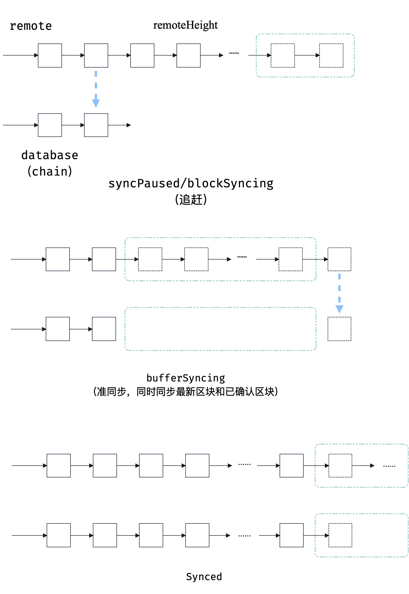

# Syncer 逻辑梳理

Git 版本号：86b9eb4 （branch v1.0.1）

区块同步的启动入口：Start 函数，启动三个协程：

1. 区块拉取协程，需要 peer 集合，间隔一定时间从某个 peer 拉取区块
2. 状态信息处理协程，从 channel 中取出状态信息，并且处理得到最新的某个 peer 上的已知的最新区块高度（取最高高度）
3. 区块处理协程，在连续的区块在缓存中出现后，验证并持久化到数据库以及 Chain 类中

## 区块拉取协程

每隔一段时间触发一次，遍历节点集合

* 检查节点是否停止运行（在断开的情况下会被标记为 stopped），如果停止，则往后遍历

* 将节点添加到 avaliable 切片中

* 取得节点的标识 ID，然后检查当前节点在上次请求后是否响应过，如果还未响应且上次的请求时间在一定范围内，则跳过

* 选取一个高度，向对端节点进行请求（selectBlockHeight 函数）

    > selectBlockHeight: 从本地已经完成的同步高度开始到已知到对端最高高度进行遍历，选取满足下列条件的高度
    >
    > * 区块没有被获取到
    > * 上一次请求的时间在一定范围外
    >
    > 这两个条件都需要满足（**fixed: 原来写的逻辑是“或”，这导致获取的时候无法高效同步**）

* 如果选取的高度小于 0 说明没有满足条件的高度，则继续遍历

最后，将节点集合替换为 avaliable（去除不可用节点），如果状态变为 synced，则关闭协程（<del>这里的状态是否应该是 bufferSyncing？</del>判断的状态应该是 synced，这是由于在 bufferSyncing 状态下，需要同步来自对端最新的已确认区块（未同步的缓冲区），并且同步缓冲区中的区块，所以这个时候需要接收、请求最新的区块）

## 状态信息处理协程

状态信息的数据结构：

```golang
type SyncStatusMsg struct {
	LatestHeight        int64    // db 中的最新区块高度
	LatestHash          [32]byte // db 中的最新区块哈希，目前逻辑中未使用
	BufferedStartHeight int64    // 缓冲区起始区块高度，目前逻辑中未使用
	BufferedEndHeight   int64    // 缓冲区截止区块高度
}
```

对端返回该信息前回对同步状态进行判断，如果没有完成同步，则返回无效的信息，该信息在处理时候会被跳过

```golang
&p2p.SyncStatusMsg{
    LatestHeight:        -1,
    LatestHash:          [32]byte{},
    BufferedStartHeight: 0,
    BufferedEndHeight:   -1,
}
```

Goroutine 处理逻辑：

1. 如果高度为 -1，状态消息为无效消息，不进行处理
2. 比较得到 `bs.remoteHeight = max(height, bs.remoteHeight)`，对端高度取最高高度（**如果有恶意节点如何解决？**）
3. 如果当前的缓冲区高度不是 -1，而且同步状态为 `blockSyncing`，则记录需要同步的缓冲区目标高度 `bs.targetHeight = max(bufferHeight, bs.targetHeight)`
4. 获取到本地的链区块高度，如果本地高度和对端高度一致，说明前置区块同步完成，需要等待缓冲区区块的同步
5. 如果本地链区块高度达到目标高度 `targetHeight`，则说明完成了缓冲区这部分区块的区块同步

## 区块处理协程

处理时间间隔常量 `checkInterval = 100 * time.Millisecond`

从已知道的区块高度开始遍历 `blockMap`，如果不为 nil 则添加到数据库，否则结束本次处理

直到 Syncer 同步状态到达 synced 为止

