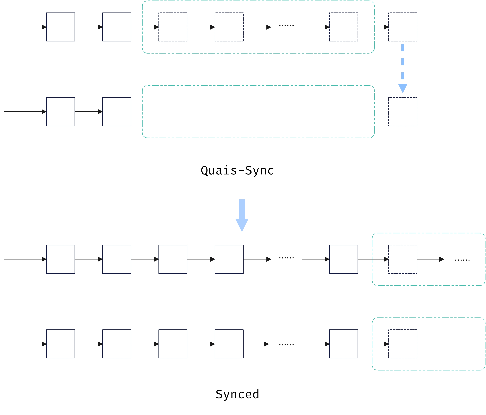

# 区块同步逻辑

**当前文档版本：**`v1.1.0`

基于缓冲区的设计，可以将区块的同步划分为三个阶段，下面的图展示了准同步状态和同步完成状态

区块同步分为三个阶段：

* 同步中：该状态下从 P2P 网络的节点中拉取已确认的区块的信息，直到和对端节点的数据库高度一致
* 准同步：该状态下完成了数据库高度的一致，但是缓冲区中的区块信息还没有达到一致，此时不同步其他节点的缓冲区，而是开始接收新打包区块，将这部分区块加入到自身的缓冲区，同时拉取剩余的高度下的缓冲区中被选取的区块
* 同步完成：在其他节点将本地节点缓冲区前的区块选取完成后，此时本地的数据库、缓冲区都和P2P网络中的信息一致，完成同步，此时本地节点可以开始参与共识进行区块的打包
