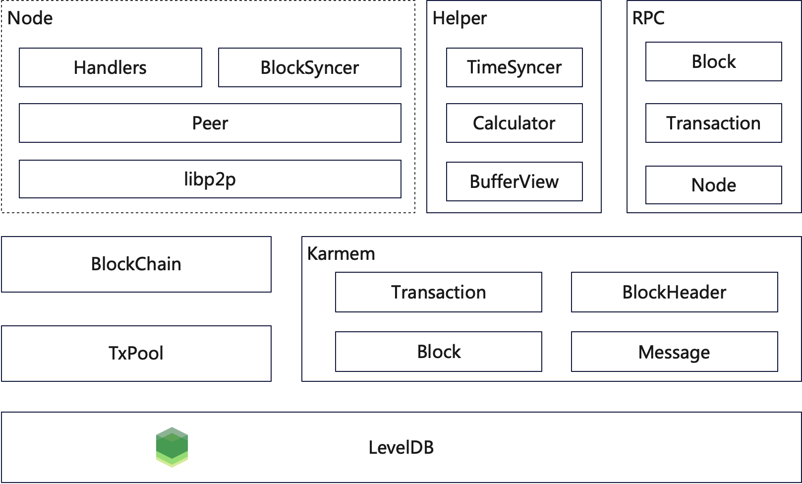

# 概览

Chronos 的基本架构图如下所示

具体地，对应到项目目录，可以划分为以下几个部分：

1. 数据库（utils/leveldb）：包含了对 LevelDB 的增删查改操作，在

2. 核心数据结构（common）：如区块、交易的数据结构，这一部分主要通过 karmem 序列化库([Karmem - Github](https://github.com/inkeliz/karmem))生成，便于进行结构的序列化和反序列化，它们对应的是架构图中 Karmem 的部分；

3. 区块链核心（core）：基于核心数据结构所实现的区块链、交易池、区块缓冲区、默克尔树的结构，它们之间相互协作完成区块的打包、持久化以及区块链的维护工作；
4. 加密运算操作（crypto）：包含了 VDF 计算类以及 VRF 计算、验证函数，主要用于选取、验证共识节点；
5. 节点通信（node）：主要的节点通信操作在 node 中实现，P2PManager 可以利用 p2p 中的 peer 作为底层进行简单通信，基于 go-libp2p 的广播协议所实现的区块广播以及基于 UDP 协议所实现的 gossip 广播；此外还有 TimeSyncer 用于进行时间同步；
6. p2p 节点（p2p）：p2p 中包含了对基础消息（Message）的封装，以及基于此实现的 peer 用于进行消息的发送；
7. rpc 接口（rpc）：作为扩展所需要实现的接口，目前只能进行交易的接收；