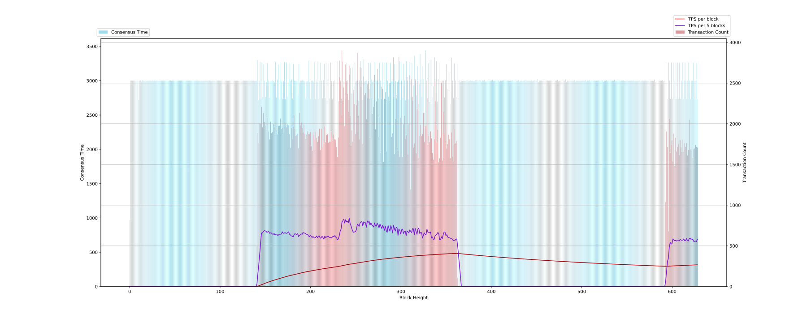
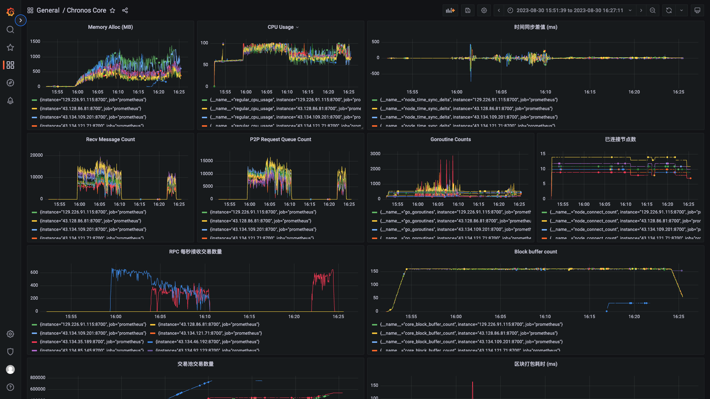

# 测试记录

**日期**：2023.08.30

**git 版本号**：d5f709c

**节点数**：10（其中两个节点在作为区块链节点的同时，作为大量发送交易的节点）

**区块打包间隔**：3s

**服务器配置**：2 CPU + 2 GB 内存

## 版本修改

与版本号 4613996 的对比

* 修复了 P2P 连接存在的问题：在其他节点通过 bootstrap 节点连接到启动节点后，无法连接到网络中的其他节点
* 使用同步后的逻辑时间来触发区块的打包，改版本下间隔 3s 进行区块的打包，prometheus所观测到的最大区块打包耗时为 150ms
* 修复区块缓冲区问题：
    1. 区块缓冲区使用了 selectedBlock 来保存区块的选取，由于前期条件设置不充分导致部分情况下某个高度的 selectedBlock 为空，进一步导致程序错误（已修复）
    2. 在打包区块时会选取区块缓冲区中的最长链中的最后一个区块进行打包，但是在实际运行过程中会导致某些节点打包时候选取了其他节点刚发过来的区块，导致本应该打包的区块存在错误。这里使用当前的逻辑时间戳和创世区块的时间戳的差值计算一个待打包的最大高度，以限制区块打包的高度来修复。
* 修复 VRF 选取问题：经过测试发现 VRF 计算得到的随机数范围在 0.1 到 0.3 范围内，这是椭圆曲线序列化所导致的。所以，将椭圆区块序列化为 bytes 后再进行一次 sha256 哈希进行修复，使得最后得到的随机数能够分布均匀。

## 测试结果

* VDF 的计算参数似乎过长？导致打包节点没有出现变化
* 打包间隔为 3s，这使得观测到到 tps 在 1000 以下，后续降低打包间隔后再进行测试
* 时间同步算法的效果较好，收敛较快，尽管运行过程中会出现波动，但是波动范围在 500ms 内，可以接受
* 接收交易的节点运行过程中会掉线，可能是因为 cpu/内存 占用过高卡死
* 暂未发现新的 bug，主要的问题集中在性能上

## 测试数据

### TPS 绘图



### Grafana 相关数据



http://localhost:3000/d/BsYlvN94k/chronos-core?orgId=1&from=1693381899626&to=1693384031934

### Graph 程序输出

```
timestamp: [971 2999 3001 3000 2999 3003 2999 2999 3001 2999 2718 3001 3005 2989 3007 3000 3000 3003 2996 3000 3000 3000 3001 3002 2998 3003 2998 3002 2998 2999 3002 2998 2999 3001 3000 3000 3000 2999 3001 3000 3000 3001 2999 2998 3001 3002 2996 3002 3002 2997 2999 3001 3000 3000 2999 3001 3000 3002 2999 2999 3000 3001 2998 3002 2998 3000 3000 3000 3000 3000 2999 3001 3000 2999 3001 3002 2999 2998 3000 3002 2998 3000 3000 3000 3001 2999 3000 3000 3003 3000 2996 3000 2999 3000 3000 2997 3002 3000 3001 2999 3000 2999 3003 2998 3002 2998 3000 3000 2999 3000 3000 2999 3000 3000 3001 3000 3002 2998 3000 3000 2999 2997 3002 3000 3000 3000 3003 2998 3000 2999 3000 3000 3001 3000 3002 3001 2998 3002 2997 3000 2999 3303 2712 3000 3274 2739 3262 2762 3237 3000 2762 2981 3257 3001 2750 3001 2998 3000 3009 2997 2973 3273 2754 3013 3231 2731 3270 3013 2987 2734 2993 3272 2734 3266 2768 2958 3027 3258 2990 3016 2740 3245 3002 2998 3001 2997 2785 3245 2975 2995 3000 3007 3001 2992 2739 2991 2994 2999 3293 2984 2733 3001 3002 2991 3273 2733 3003 2984 3282 2736 2999 3263 3001 2745 3009 3246 2747 3264 2712 3019 3257 2741 3267 2997 2727 2991 3007 2992 3278 2714 3287 2702 3297 3000 2736 3277 2990 2726 3271 2738 3262 3007 2723 3091 3183 2811 3190 2819 2919 3267 2990 3000 3001 2708 3005 3288 2998 2717 3312 2976 2995 3000 3000 2742 3258 2737 3263 3015 2985 3002 2723 3275 3001 3000 3002 2739 3258 3001 2732 3269 2727 3009 3263 2736 3263 3000 2769 2971 3260 3001 2999 3003 2760 3243 2995 2741 2979 3003 3286 2718 3273 3002 2751 3246 3004 2712 3284 3000 2729 3271 3000 2747 3253 2706 2932 3365 2999 2787 3211 2666 2947 3391 3016 2769 3212 3025 2534 3441 3002 2748 3254 2691 3304 2690 3310 2764 2919 3338 2708 3286 2695 3029 3262 3000 2999 3000 3000 3000 2754 3008 3238 2877 3137 2864 3122 2666 3334 3000 2749 3251 3000 2760 3241 2744 2996 3009 2984 2995 2996 2997 3000 2996 3000 3010 2990 3000 2999 3007 2998 3001 2992 2994 3010 3010 2985 3010 2991 3010 3003 2989 3006 3000 3012 2988 2990 2999 3002 2999 3000 3000 3002 3013 2994 3000 3000 3000 3006 3002 3004 2988 3000 2999 3003 3007 2991 3000 3013 2999 3001 3001 2998 3000 3000 3010 2990 3001 3017 2983 3000 3000 3012 2988 2999 3005 2996 3000 3000 3013 2987 2999 3000 3000 3000 3001 3008 2991 3000 3001 3010 2990 3000 3020 2980 3000 3000 3002 2998 3000 3003 2996 3001 3000 3002 2998 2999 3000 3003 2998 3000 3013 2987 3000 3000 3013 2987 3000 3000 3000 3012 2988 3000 3000 3019 2981 3000 3000 3000 3000 3000 3001 2999 3000 3014 2986 3000 3001 2999 2999 3001 3000 2999 3003 2998 3000 3011 2988 3001 3000 3010 2990 3000 3007 2993 2999 3003 2998 3000 2999 3004 2997 3000 2999 3012 3006 2982 3000 3000 3007 2993 3001 3000 3002 3003 2995 3000 3000 3013 2989 2998 3000 3000 3004 3002 2993 3000 3001 3006 2996 2998 3000 3002 3002 2996 3000 2999 3001 3000 3004 2996 3000 2999 3000 3000 3001 3006 2994 3000 3001 2999 3000 3002 2998 3000 2999 3001 3000 3002 2998 2999 3000 3017 2984 2999 3019 2983 2999 3002 2998 2999 3008 2992 3001 2999 3269 2997 2734 3266 3000 2735 3265 2734 3267 3001 2733 3266 2734 3266 2734 3266 2733 3000 3267 2733 3000 3267 2999 2734 3001 3265 3002 2732 3000 3001 3265 3001 2733 3000 3266 2734]
counts: [0 0 0 0 0 0 0 0 0 0 0 0 0 0 0 0 0 0 0 0 0 0 0 0 0 0 0 0 0 0 0 0 0 0 0 0 0 0 0 0 0 0 0 0 0 0 0 0 0 0 0 0 0 0 0 0 0 0 0 0 0 0 0 0 0 0 0 0 0 0 0 0 0 0 0 0 0 0 0 0 0 0 0 0 0 0 0 0 0 0 0 0 0 0 0 0 0 0 0 0 0 0 0 0 0 0 0 0 0 0 0 0 0 0 0 0 0 0 0 0 0 0 0 0 0 0 0 0 0 0 0 0 0 0 0 0 0 0 0 0 0 492 1886 1761 2005 1999 2206 1958 2131 2021 1978 1925 2094 2069 1905 1810 2029 1886 1899 1995 1965 1883 1906 1919 1870 1974 1978 2065 1940 1950 1886 2005 1984 2006 1957 1992 1979 1873 1703 1947 1810 1963 2103 1933 1851 1860 1878 1700 2133 1979 2015 1947 1892 1991 1872 1812 1867 1907 1875 1876 1900 1725 1670 1893 1857 1807 1902 1825 1778 1847 1941 1673 1940 1709 1797 1759 1968 1771 1862 1871 1766 1780 1778 1900 1837 1790 1867 1811 1803 1717 1592 1831 2570 2510 2101 2901 2283 2446 1970 2727 2523 2367 2147 2714 2095 1731 1919 1780 2415 2246 1875 2229 2873 2098 1808 2694 2458 2686 1749 2581 2351 2377 2058 2491 2523 2429 1826 2486 2315 2119 2207 2599 1933 2276 2674 1833 2087 2673 1639 2456 2430 1532 2307 2389 1660 2266 2640 1535 2281 2506 1839 1883 2815 1629 2061 2356 1701 1664 2822 1594 2075 2529 1593 1993 2098 1814 1860 2575 1622 1997 2594 1195 2552 2331 1707 1758 2548 1635 2178 2527 1576 1852 1987 1849 1874 2133 1776 1973 1968 2559 1741 1856 1776 1906 1822 1639 1559 1810 2527 1988 1767 1927 1526 1575 1829 2505 1548 2142 1882 1785 2004 1695 1750 1866 1812 1578 1892 1596 1538 1939 1754 1761 1790 108 0 0 0 0 0 0 0 0 0 0 0 0 0 0 0 0 0 0 0 0 0 0 0 0 0 0 0 0 0 0 0 0 0 0 0 0 0 0 0 0 0 0 0 0 0 0 0 0 0 0 0 0 0 0 0 0 0 0 0 0 0 0 0 0 0 0 0 0 0 0 0 0 0 0 0 0 0 0 0 0 0 0 0 0 0 0 0 0 0 0 0 0 0 0 0 0 0 0 0 0 0 0 0 0 0 0 0 0 0 0 0 0 0 0 0 0 0 0 0 0 0 0 0 0 0 0 0 0 0 0 0 0 0 0 0 0 0 0 0 0 0 0 0 0 0 0 0 0 0 0 0 0 0 0 0 0 0 0 0 0 0 0 0 0 0 0 0 0 0 0 0 0 0 0 0 0 0 0 0 0 0 0 0 0 0 0 0 0 0 0 0 0 0 0 0 0 0 0 0 0 0 0 0 0 0 0 0 0 0 0 0 0 0 0 0 0 0 0 0 0 0 0 0 0 0 0 0 0 0 1040 1904 1713 678 2064 1640 1739 1797 1536 1879 1482 1829 1659 1715 1749 1615 1797 1711 1652 1806 1657 1761 1719 1760 1611 1677 2049 1682 1693 1673 1583 1687 1697 1740 1719 1709]
total: 504163
packageAddr:  {"030bdf68":4,"0329f382":149,"036cae46":211,"0396f954":79,"03b2a49f":186}
```

