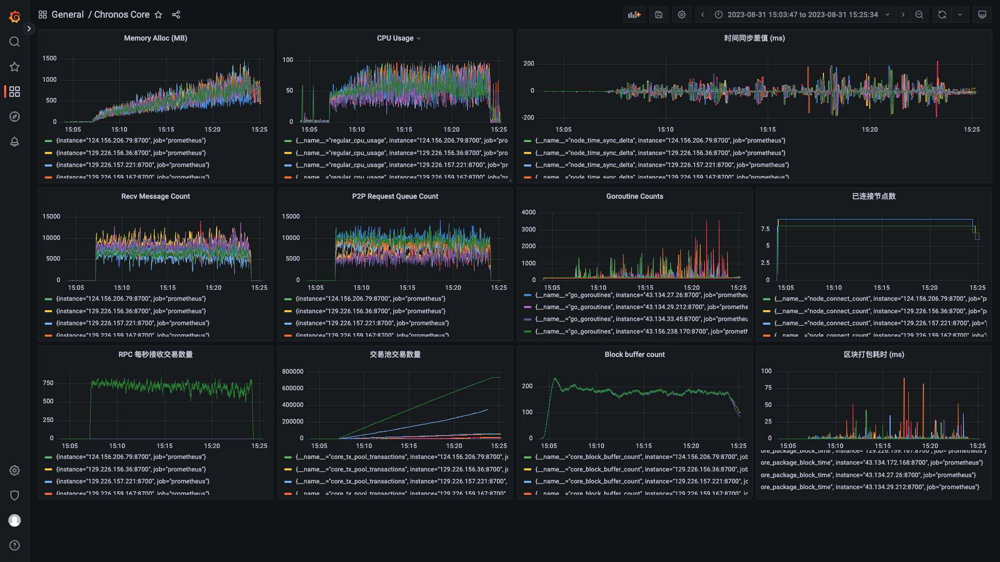

# 测试记录

**日期**：2023.08.31

**git 版本号**：f693412

## 版本修改

与版本号 d5f709c 的对比

* 修改了时间间隔为1s、2s进行测试（1s的情况下在开始发送交易后卡死，测试数据不保留）
* 修改的 VDF 的计算参数
* 修复从交易池根据hash获取交易时返回nil的问题

## 测试结果

* 在 20 个节点下，大量发送交易时会导致节点 CPU 占用率过高，需要进一步优化代码或提高机器配置
* 打包间隔、触发打包的机制需要进行调整
* VDF 存在一点问题，共识节点应该在一段 VDF 周期内都是共识节点，但是在测试时出现在某个高度下是共识节点，而在下一个高度且 VDF 没有更新时又成为共识节点

## 测试数据

### 测试数据 1

**节点数**：19+1（19个区块链节点+1个交易发送节点）

**服务器配置**：2 CPU + 2 GB 内存

**区块打包间隔**：2s

#### TPS 绘图


#### Grafana 相关数据


http://localhost:3000/d/BsYlvN94k/chronos-core?orgId=1&from=1693464762807&to=1693464971672

#### Graph 程序输出

```
timestamp: [4944 12565 2 1999 2000 1999 2001 1999 1 1993 6 1 1992 8 0 1993 2 1996 2002 1999 2000 1999 2002 2000 1999 2001 2001 2000 1999 2001 1999 2001 1999 1441 2000 2556 1444 2000 2556 2000 2002 1442 2000 2555 2007 1999 2012 1900 2091 1998 2016 1979 2010 1198 1876 2043 1944 1997 2374 2594 1407 2582 1981 2006 1991 1103 2891 1977 1955 1132 2946 1935 2060 1060 2773 1926 2252 1999 1431 2568 1166 2835 5802 -1931 10108 1072 -5294 7905 -3862]
counts: [0 0 0 0 0 0 0 0 0 0 0 0 0 0 0 0 0 0 0 0 0 0 0 0 0 0 0 0 0 0 0 0 0 0 0 0 0 0 0 0 0 0 0 0 372 1757 3186 4157 1919 2205 4362 3502 2861 5000 2644 2414 2300 4002 3995 4153 1921 1901 2842 3695 2817 2265 3474 998 3326 5000 3273 2546 1431 5000 3032 3436 2827 4184 5000 3430 3462 3398 4117 5000 1926 780 5000 2112 5000]
total: 142022
packageAddr:  {"023daab3":7,"027a4425":2,"02d44919":6,"02d7c282":4,"02e0958a":2,"02e3aeee":5,"02fe042a":10,"02ff1e57":8,"03090326":4,"031f9378":9,"0329be10":13,"03408791":5,"038aa6d0":3,"03a050c8":4,"03aa6944":6,"03ac2a78":1}
```

### 测试数据 2

**节点数**：9 + 1 （9个区块链节点及单个发送交易节点）

**服务器配置**：2 CPU + 2 GB 内存

**区块打包间隔**：2s

在测试运行到高度 556 时由于部分节点内存占用过高终止，终止高度 598

#### TPS 绘图


#### Grafana 相关数据



http://localhost:3000/d/BsYlvN94k/chronos-core?orgId=1&from=1693465427653&to=1693466734181

#### Graph 程序输出

```
timestamp: [967 2001 2000 1999 2000 2000 2000 2000 2000 2000 2000 2001 2000 1999 2000 2001 1999 2000 2000 2000 2001 1999 2000 2000 2001 1999 2000 2000 2000 2000 2000 2000 2000 2000 2000 2001 2932 1067 2932 2001 1068 1999 2000 2000 2000 2000 2934 1066 2000 2000 2000 2933 1067 2934 2001 1065 2934 2001 1065 2000 2001 2000 2931 1068 2000 2932 1068 2000 2000 2000 2931 1069 2000 2931 1069 2000 2000 2000 2930 1070 2000 2000 2000 2000 2000 2929 2003 2000 1068 2930 2007 1063 2930 1998 1999 2001 2015 1987 1070 2928 1072 2928 1072 2950 1996 1054 2932 1953 2033 2010 2003 1988 1986 2005 1999 1091 2942 1935 2004 2018 2029 1951 1122 2922 1957 2016 2042 2011 1991 1988 1072 2906 2000 2019 1075 2941 1985 1999 2004 1071 2940 1987 2000 1073 2928 2000 2012 2001 2000 1059 2940 1985 2034 1965 2015 2002 1967 1987 2008 2017 2004 2008 1068 2930 2009 1960 2000 2045 1958 2055 1997 1983 1984 1957 1122 2936 1991 2015 1988 2018 1052 2935 1992 1980 1971 1122 2000 2935 1979 1087 2950 1991 1998 1060 2922 1078 2901 2029 1070 2924 2018 1989 1998 1994 1077 2921 2017 1062 2991 1936 2010 2026 1978 1986 2000 1997 1999 2069 1951 1983 1074 2926 1074 2907 2037 1983 1986 2018 1070 2006 2912 1081 2933 1973 1978 1995 1986 2046 1966 1986 2001 2055 1082 2924 2044 1956 1261 2763 1051 2000 2950 1918 2093 1934 2032 1979 1988 2049 1057 2987 1991 1024 2955 1965 2016 1997 1066 2959 1969 1992 2018 1979 2019 1990 1073 2953 1987 1060 2951 1975 2010 1064 2926 2036 1038 2945 1994 1069 2940 1052 2939 2001 2022 1959 1080 2926 1073 2927 2000 2010 2003 1985 2014 1982 2007 1944 2014 1114 2862 1138 2000 2838 2077 1939 2049 1097 2961 1999 2005 1035 2960 1041 2935 1987 1077 2940 1060 2000 2929 2010 1990 2001 1989 1081 2939 1985 1997 2003 2001 2011 1985 2018 1061 2921 2004 2000 1075 2000 2872 2023 1995 2019 2016 1075 2885 1115 2940 1984 1077 2923 2006 2041 1029 2925 1075 2925 1075 2933 1992 2001 2000 1995 1086 2934 1985 1074 2966 1958 2001 2057 1939 2004 1992 2000 2048 1972 1063 2922 2000 2000 2010 2005 1981 2011 1993 1993 1987 2017 2020 1968 2010 1102 2904 1077 2000 2000 2954 1979 1992 1075 2938 1982 2018 1989 2014 1983 1182 1894 2092 2822 2022 1065 1999 2057 2881 1934 2050 1999 2001 1078 2000 2931 1972 2004 1979 1114 2937 2001 1062 2884 2046 2003 1975 2031 2000 1983 1997 2016 2002 1982 2004 2008 1985 1989 1095 2912 2034 1972 1083 2939 1976 2014 1992 2028 1982 1993 1077 2928 1082 2919 2026 1983 2001 2000 1059 2940 1985 2022 1059 2899 1095 2000 2951 2000 2022 1947 2031 1991 1058 2950 1981 1118 2915 1962 1999 1075 2000 2967 1970 1980 2052 1957 2010 1064 2097 2010 1893 2919 2008 1073 2927 2005 1997 2045 1975 1051 2000 2942 1985 2000 1073 2923 1154 2840 2006 2000 1077 2929 1938 1181 2873 2023 1999 1980 1077 2894 2029 2005 2008 2000 2004 1060 2943 1999 1069 2919 1092 1979 2929 2036 1037 2964 1983 1995 2011 1992 1052 2040 1960 2933 2005 2000 1984 2019 2003 2038 1989 1927 1998 2028 1076 2889 1111 2931 2000 2032 2024 1955 1059 2001 2981 1998 2013 1007 1999 2923 1077 2929 1297 2700 1991 2010 1989 1993 1997 2011 2020]
counts: [0 0 0 0 0 0 0 0 0 0 0 0 0 0 0 0 0 0 0 0 0 0 0 0 0 0 0 0 0 0 0 0 0 0 0 0 0 0 0 0 0 0 0 0 0 0 0 0 0 0 0 0 0 0 0 0 0 0 0 0 0 0 0 0 0 0 0 0 0 0 0 0 0 0 0 0 0 0 0 0 0 0 0 0 0 0 92 1788 1516 3211 4897 1051 2753 1366 3084 1361 2946 1571 3158 5000 1463 4189 1410 3144 4501 2799 1546 1581 1608 5000 5000 1714 5000 5000 3630 1479 3053 3183 2939 2864 1492 3004 1514 3031 3068 1726 4857 2752 2385 1544 3113 5000 2569 1498 2944 1544 1517 1771 5000 4632 1615 3259 1391 2976 5000 4091 1557 5000 3901 3056 2929 1510 1755 1735 4924 5000 1060 4322 2911 2821 1403 1581 4730 1189 1819 4583 1118 4273 1470 73 5000 2587 5000 2483 5000 4148 1352 2853 3136 2976 1574 4639 1049 1603 3112 5000 1978 2706 1415 1541 1532 3027 4516 1416 1744 3242 1788 5000 4410 1795 3249 1688 3078 2890 1471 1717 1718 3143 5000 4011 1231 3790 3179 4660 1196 4318 1693 5000 1896 2868 5000 1431 5000 1609 4295 3100 3040 3085 5000 5000 2190 5000 3143 4550 1174 4288 3003 1764 2675 2977 1335 1572 3014 3192 1338 5000 5000 3002 2937 1301 3356 5000 4400 1740 2977 1118 1606 5000 5000 3941 2990 3473 2842 1315 2982 1523 3100 327 5000 5000 2138 3746 2770 2850 1289 1459 4104 1405 1798 4813 2766 5000 4217 841 2238 1935 1419 2858 1532 2973 1288 1796 4745 964 1653 1501 1565 1451 5000 2167 1741 4672 915 1791 4323 1090 4185 4006 1274 2733 1489 4727 1709 5000 2453 1964 5000 1450 1482 3036 1436 2951 2620 1407 2975 2990 1441 1437 2981 4335 1349 1598 4390 1470 2233 1574 5000 1484 1569 1658 5000 2882 2135 2738 1505 1510 4457 1123 3288 4891 2694 2540 3156 1205 1538 3026 1750 4679 4159 2013 3395 1533 2946 1397 2875 1584 3005 2861 1220 1663 1482 5000 5000 2842 953 2443 1461 3210 1309 4625 5000 4819 5000 3327 5000 1718 2747 1521 4375 3119 1475 2827 2850 2914 294 5000 1089 1818 5000 5000 874 2966 5000 5000 5000 2383 2890 1469 2965 1489 4493 3052 1415 1267 3920 3110 2058 2769 3660 1977 3160 1536 1745 4048 5000 5000 3611 1987 3139 5000 4749 5000 5000 2725 1035 2395 5000 2978 1748 1579 4245 3076 1178 2779 1437 3126 2468 1164 1604 4204 1397 2338 2860 1542 1380 1568 5000 2284 1314 692 4813 5000 1982 2922 3954 4092 4056 1598 2931 2002 3906 1341 1552 1556 5000 4251 2039 1327 2731 3144 1130 1767 4176 1753 5000 1413 1179 5000 3892 5000 2570 2734 1770 5000 3636 1316 1759 1578 552 5000 1710 5000 1464 2340 2334 2737 2212 1662 4086 4475 1351 3047 1256 5000 2184 1865 1459 1222 1605 1447 4588 1188 4549 1699 5000 5000 5000 1892 1906 2144 4057 995 1556 5000 4098 2254 1676 5000 1699 1816 5000 4394 5000 2553 3844 2004 2205 4258 1264 1387 4304 2965 1489 3875 2239 2829 5000 1615 4230 1263 2336 3689 2683 1302 1704 4699 848 1272 1409 5000 4326 1478 1776 2877 1229 4531 2738 970 5000 3778 1635 2996 1225 2187 5000 1748 3406 5000 4083 1819 1581 1167 3009 0 3 3 3]
total: 1430309
packageAddr:  {"02c38d5c":102,"02d7c282":20,"02e0958a":12,"02fe042a":174,"02ff1e57":116,"031f9378":2,"0329be10":3,"0350d495":15,"03ac2a78":153}
```


