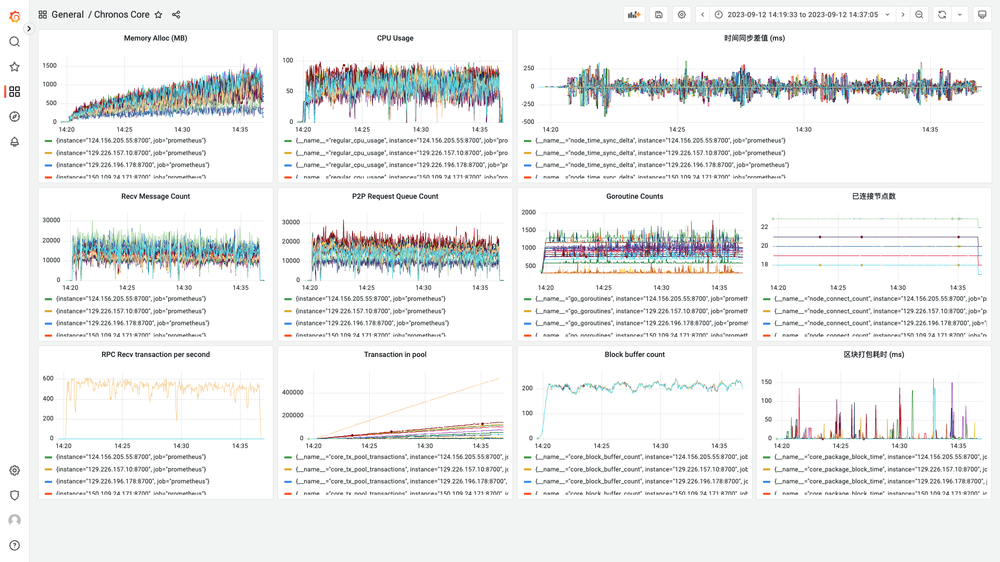

# 测试记录

**日期**：2023.09.12

**git 版本号**：0ef56e6

**节点数**：19 + 1

**区块打包间隔**：2s

**服务器配置**：4 Core + 4 GB 内存

## 版本修改

与版本号 f693412 的对比

* 修改了 Blockchain 类的区块缓存大小
* 调整了交易池的处理逻辑

## 测试结果

* 在 20 个节点的情况下可正常运行

## 测试数据

### TPS 绘图

![[2023-09-12 14:51:29]chronos_tps](./assets/[2023-09-12 14:51:29]chronos_tps.svg)

### Grafana 相关数据



http://localhost:3000/d/BsYlvN94k/chronos-core?orgId=1&from=1694499572953&to=1694500625447

### Graph 程序输出

```
timestamp: [3950 3924 2000 1999 2001 1999 3 1997 3 1998 2000 2001 2000 2000 2000 2000 1999 2000 2000 2000 2000 1999 2000 2002 1999 2077 1929 2015 1984 1996 2012 1989 2074 1923 2010 1991 2005 2020 1983 1850 2047 2023 2109 1844 1990 2205 2000 1797 2131 1978 2029 1406 2659 1926 176 3752 2146 1837 2200 1982 1928 2082 32 2009 1999 2083 1946 1966 2042 3074 897 3923 1171 2053 2776 1193 2066 2048 2693 1306 2006 2612 235 3027 2732 1989 2015 1979 2043 1997 2024 1972 2032 2041 1929 2087 1974 2015 1985 2008 2010 2003 1941 2038 2000 2000 1941 1987 154 3879 1984 1980 2000 1999 2028 2000 1994 2054 1921 2128 1858 2004 2010 2025 2054 1983 1960 2057 1925 1998 2058 1957 1958 2076 1942 2086 2000 1926 2000 2038 2038 1998 1956 1948 2103 1914 2031 2049 1999 1863 2113 2037 1965 2041 51 3931 2021 1951 1998 1998 2002 2005 1995 2026 1907 2002 2105 1999 1990 1844 2118 2014 1948 2000 1882 2191 1919 1939 2058 1962 2125 1917 1996 2047 1948 2070 2022 1908 2055 2005 1939 2009 2052 2038 1962 82 3950 1864 2007 2048 2004 2003 1832 2021 2101 1947 2001 2008 2001 1983 2102 1949 1953 1989 2106 1897 2024 2049 2045 1914 2053 2025 1997 2077 1923 1996 2009 2043 1986 1967 2021 2063 1935 2000 1872 2006 1994 2185 1812 2004 2004 1966 2259 1881 2105 59 3821 183 1995 1995 3846 2007 1986 1977 2128 1900 2001 2071 2000 1926 2025 1984 2002 1988 2032 2004 2039 2000 1988 1998 1974 2018 1985 1983 2017 2034 2013 1194 2751 2030 2015 1985 1996 2019 2000 1921 2044 1969 2004 1975 2056 1989 2036 1999 2007 1949 2003 1973 2031 1983 2028 1977 1855 2201 2000 1793 2146 1981 1963 2012 2003 2056 2046 2000 1943 1939 1987 2086 1953 2062 1944 2063 2023 1946 1980 2022 2053 2032 1902 2106 1991 100 1967 1983 2002 2029 1983 2011 1989 2023 3802 192 1994 2009 3867 2017 1921 165 3897 1975 100 3866 1977 1954 2091 2032 1994 2028 2000 1953 1996 2005 1990 177 3879 1958 2000 1969 2028 1945 2101 1924 1980 2020 2007 2006 1962 2100 1952 1977 1984 2071 2016 1971 1960 2028 1983 1985 1980 2093 1972 1909 2046 2073 1979 2005 1922 2075 1994 2015 1983 1954 2078 1981 1997 1905 2013 2018 1920 2089 1990 2082 1944 2025 1969 2041 1936 2000 2082 1947 1941 2024 1996 1913 2113 1982 2006 1994 2015 2064 1998 2021 1981 2027 1981 1968 1953 2012 2003 2016 2048 1927 2060 1972 1957 2096 1946 1964 2042 1976 2082 1907 2075 1998 1999 2018 1985 1921 177 3898 2041 1951 1931 2001 1990 2100 1942 1988 1984 1994 2006 1967 2035 1993 2000 1868 2099 2052 1846 2212 2021 2009 1974 1963 2033 2000 74 3835 2016 1997 2039 2000 1984 1978 2020 1998 1995 1976 1996]
counts: [0 0 0 0 0 0 0 0 0 0 0 0 0 0 0 0 0 0 0 0 0 0 1709 3089 2423 2500 2439 2256 2480 3846 2887 3289 2500 3281 2502 2444 4095 2649 3306 1246 4141 998 4036 2867 0 2500 2500 2533 2396 3671 4999 1459 2319 2764 2688 3892 2186 1264 3549 3656 3017 2685 4115 2442 3935 2487 4056 3450 3891 3180 4008 2378 4054 1532 2503 3589 2789 2536 2433 4966 2751 2100 3290 4923 3552 4735 1203 4669 4914 2951 4760 4719 4301 2500 3049 2585 2500 3975 2500 3509 3979 3802 3445 2503 2500 1631 4065 3677 3863 3207 1174 3964 2433 1030 4017 2785 4009 2510 2404 3652 1536 4699 2739 1009 2507 3712 4565 2259 1500 4104 2621 4224 2519 2438 2940 2500 2500 2903 2050 1410 3178 2508 3879 4500 3193 1654 2358 2500 2500 795 4116 3504 1058 3436 4752 2457 3746 2354 2477 1198 4429 4961 2306 1358 4544 4534 1435 3820 1236 4975 4039 4666 4645 3781 4206 3538 2559 2413 2559 4012 2500 3848 4038 4435 2253 4151 1053 1494 3944 4979 1749 1441 3690 3409 1651 2010 1226 4898 2388 1061 1339 4094 4454 3528 2465 4050 3418 3810 2282 1159 4952 4147 3959 3187 4301 3505 1418 3365 2315 1289 3377 2104 3884 2469 4087 3560 2594 3881 4999 2503 1025 1458 1286 3200 3404 1962 2500 2500 4032 2403 4825 2351 3848 2551 2188 3536 2281 3190 3515 2203 2617 3879 3596 4107 1142 2861 3777 2518 2500 2586 2604 3771 4364 1265 2849 4873 2504 2081 3735 2253 2541 4102 2705 3206 3478 2689 3998 3876 4471 2056 2531 3568 4589 2500 1476 4169 2301 1603 3814 4470 1459 4976 4632 3595 2527 3601 4328 1011 2077 1192 2723 4959 0 2511 2500 2421 3882 2373 2549 3383 2631 2992 2520 2500 4374 3542 2161 3570 2317 2197 2432 3258 2500 3200 4893 3187 1932 1163 4532 961 1450 3895 2917 3861 3257 2275 3634 4106 3225 3649 2303 3356 2266 1786 2673 2500 1348 2156 2243 782 3259 3221 4855 1912 2273 1132 3908 2509 2500 2600 3978 2051 2215 3400 1165 3527 2177 2125 2740 2512 2517 3136 4956 3495 2806 2495 3809 1037 3757 3965 4448 2199 2453 3921 1935 1329 4316 3948 3735 2130 4146 2559 2399 2502 3324 820 2063 2491 1134 3789 4065 787 1353 3438 4020 3669 2079 3945 2493 3750 2295 935 2975 2449 3379 3046 3948 3712 4240 1312 1143 3296 4436 3354 2037 3005 2249 2037 2445 2439 4030 3410 1006 3571 951 4418 3039 4197 1304 3121 2500 4972 4917 3453 1123 1154 2459 2363 1198 3983 2047 1157 3973 2767 4901 2051 3455 2405 4119 2506 3418 3004 2538 1072 4035 2938 3708 1781 1148 3807 2111 2032 3062 2456 3260 3682 2053 4014 2946 2501 3806 3522 2184 1982 2500 2500 2467 3509 2277 2490 4102 2339 3446 4598 1160 3820 4488 1370 4883]
total: 1402257
packageAddr:  {"0260077e":47,"026b4bab":41,"029f7859":59,"02a6ece2":46,"02da3e37":44,"02e7b4dc":38,"02eb3f0f":56,"02ec48f2":25,"02f8355f":34,"030961c6":52,"033dbaa6":45,"0378ec2b":1,"0395ae9c":8,"03dabd6e":2,"03e935eb":1}
```

