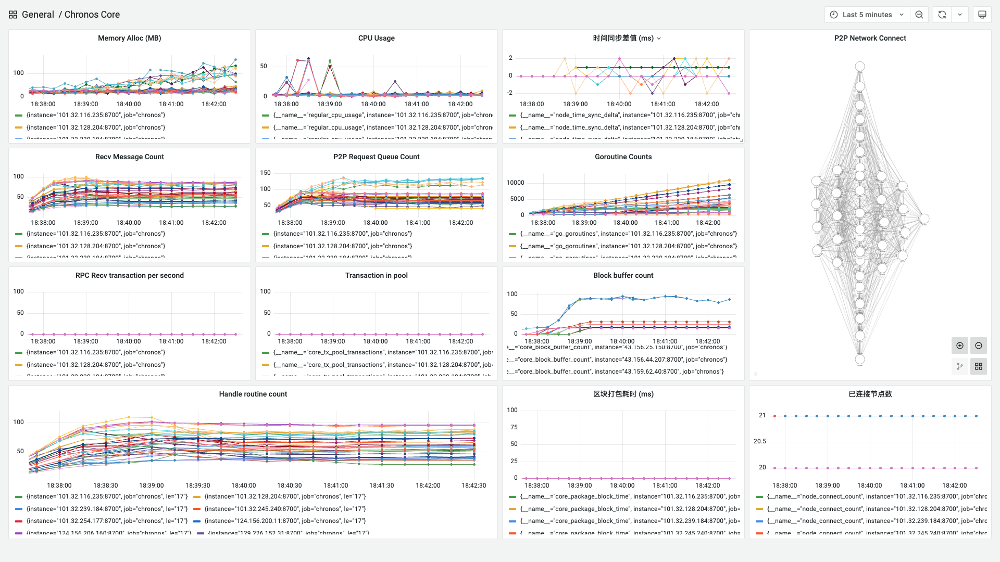

# 测试记录

**日期**：2023.09.18

**git 版本号**：9cc5b7e（branch v1.0.1）

**节点数**：40

**区块打包间隔**：2s

**服务器配置**：2 Core + 2 GB 内存

## 版本修改

与版本号 0ef56e6 的对比

* 修复 P2P 网络连接的问题，原有的网络连接几乎是完全图，导致节点负载过高，通过修改 P2PManager 的逻辑进行了处理
* 添加了获取节点连接信息的接口，便于观察网络连接情况
* 修复存在的空指针问题：core/buffer.go :193
* **本次测试针对 P2P 节点连接问题**

## 测试结果

* P2P 网络问题修复
* 开始发送交易后网络表现不正常，需要后续进一步测试

## 测试数据

### TPS 绘图

无 TPS 绘图

### Grafana 相关数据

http://localhost:3000/d/BsYlvN94k/chronos-core?orgId=1&from=1695033391515&to=1695034149571

### Graph 程序输出

无 TPS 测试数据