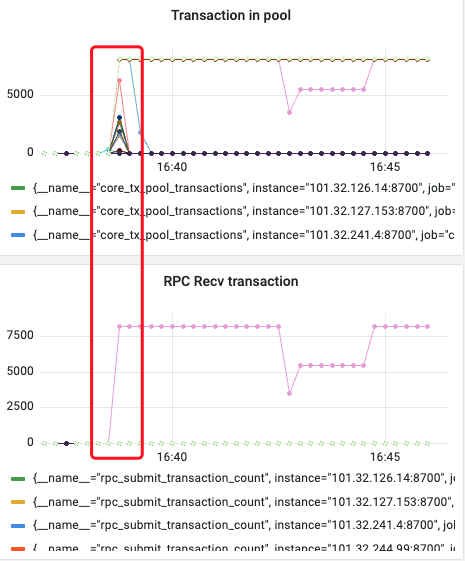
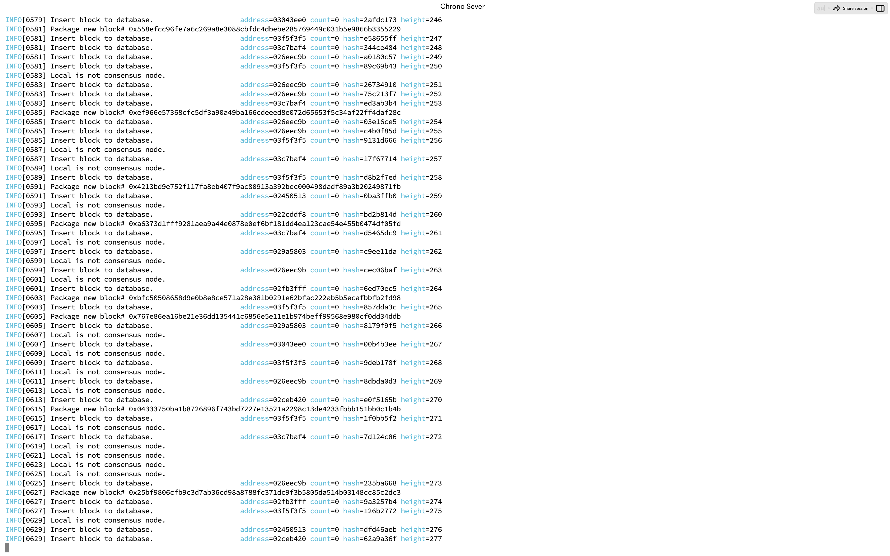
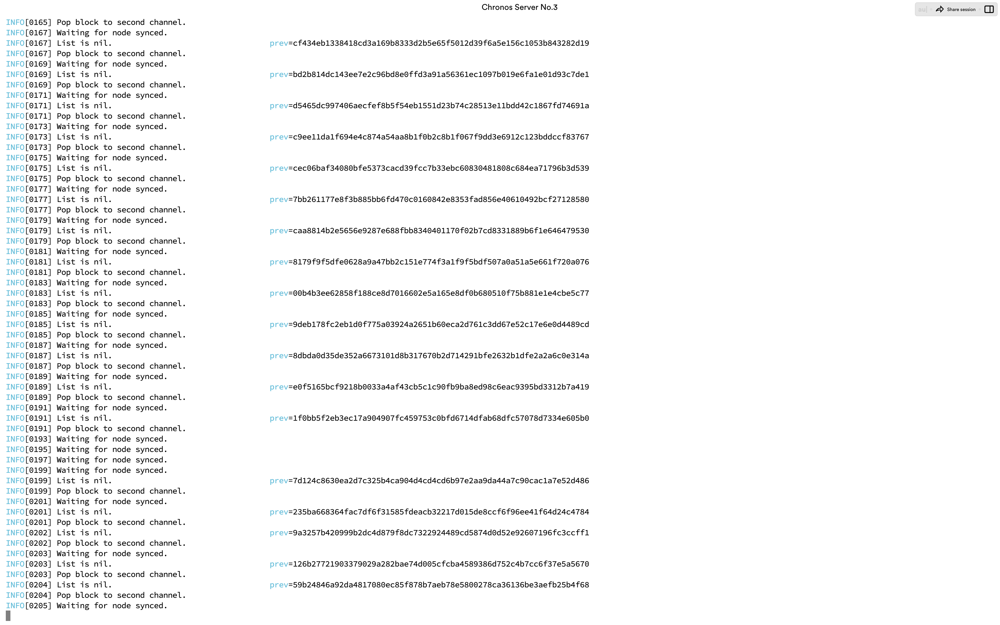
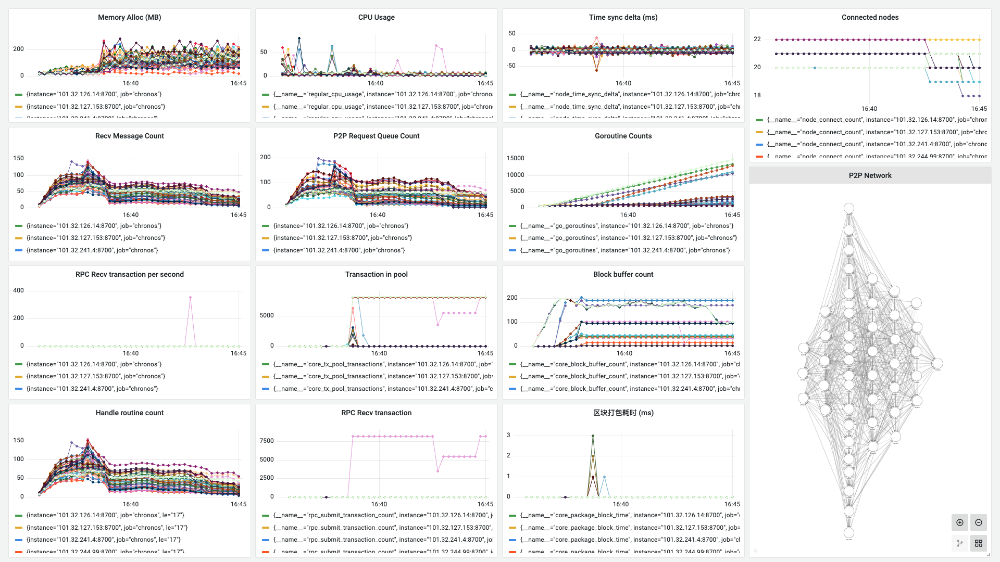

# 测试记录

**日期**：2023.09.21

**git 版本号**：3ff8f84（branch v1.0.1）

**节点数**：49 + 1

**区块打包间隔**：2s

**服务器配置**：2 Core + 2 GB 内存

**单节点连接阈值**： 20

## 版本修改

与版本号 9cc5b7e 的对比

* 将交易的广播转移为使用 `go-libp2p-pubsub` 的 Gossip 广播，不再占用原有的 P2P 通信信道

## 测试结果

* 存在问题：在启动发送交易的节点后，其他节点在 P2P 广播下接收了一瞬间的交易，后续交易池交易数量将为0，需要查明原因

    

* 交易缓冲区的设计存在问题，启动节点可以正常工作，但是部分节点在启动后一直添加区块到第二队列

    启动节点正常工作：

    

    部分节点一直添加区块到第二队列：

    

* 在调整网络结构、限制后，节点处理和CPU的开销降低了，相较于版本 0ef56e6，在运行时 CPU 占用率不会过高(这里的原因还是使用了 pubsub 进行广播，去除了了原有的处理过程)

* 部分节点 Goroutine 数量一直上升，应该和**同步的逻辑**有关

* 使用 `go-libp2p-pubsub` 来进行交易的广播后避免了区块读取延迟的问题，运行较为稳定

## 测试数据

### TPS 绘图

无 TPS 绘图，交易的广播在一段时间后结束，待查明原因

### Grafana 相关数据

http://localhost:3000/d/BsYlvN94k/chronos-core?orgId=1&from=1695285316091&to=1695285910091&kiosk

节点连接网络：

### Graph 程序输出

无 TPS 测试数据