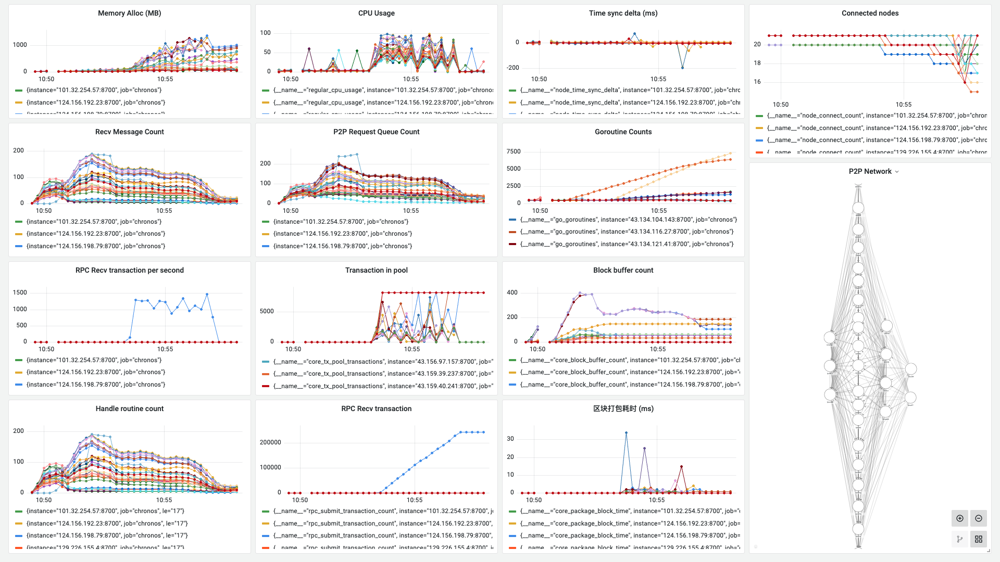

**日期**：2023.09.25

**git 版本号**：86b9eb4（branch v1.0.1）

**节点数**：29 + 1

**区块打包间隔**：2s

**服务器配置**：2 Core + 2 GB 内存

**单节点连接阈值**： 20

## 版本修改

与版本号 3ff8f84 的对比

* 设置了区块同步器拉取的限制：只有对端节点返回信息后才能进行下一步测试

## 测试结果

* 存在问题：区块同步的代码存在问题，部分节点无法正常的同步区块数据并且进入共识状态


## 测试数据

### TPS 绘图

![[2023-09-25 11:06:21]chronos_tps](./assets/[2023-09-25 11:06:21]chronos_tps.svg)

### Grafana 相关数据



http://localhost:3000/d/BsYlvN94k/chronos-core?orgId=1&from=1695610162593&to=1695610694412

### Graph 程序输出

```
timestamp: [949 2000 2001 1999 2000 2001 1999 2001 1999 2001 1999 2000 2001 1999 2000 2000 2000 2000 2001 2000 1999 2000 2001 2000 1999 2001 2000 1999 2000 2000 2001 2000 1999 2001 1999 2000 2411 1998 1592 1999 2407 2001 1592 2000 2000 2410 1998 1592 2001 11999 410 1 0 1996 5 1589 407 1592 2001 1999 2000 2000 2001 2000 1999 2000 2001 1999 2001 2407 1593 2000 1999 2001 2404 1595 2411 1589 2001 1999 2000 2407 1593 2000 2000 2000 2000 2000 2001 2410 1589 2412 1995 2016 1577 2406 2003 1454 2444 1693 2411 1589 2412 1922 1403 2675 1999 1982 1607 2000 2423 1577 1852 2571 1982 1213 2794 1588 2405 2006 2012 2000 1577 1851 2555 1997 2008 2001 1588 2406 1626 2391 2000 1577 1992 2422 1996 1590 2406]
counts: [0 0 0 0 0 0 0 0 0 0 0 0 0 0 0 0 0 0 0 0 0 0 0 0 0 0 0 0 0 0 0 0 0 0 0 0 0 0 0 0 0 0 0 0 0 0 0 0 0 0 0 0 0 0 0 0 0 0 0 0 0 0 0 0 0 0 0 0 0 0 0 0 0 0 0 0 0 0 0 0 0 0 0 0 0 0 0 0 0 553 3888 1877 3419 2412 2743 5000 5000 5000 5000 5000 2778 2663 2740 5000 5000 5000 2561 2846 5000 5000 3535 5000 4777 5000 5000 5000 3107 5000 5000 5000 5000 5000 5000 5000 3454 5000 5000 5000 4863 5000 3777 5000 5000 5000 5000 5000 5000 3527 3085]
total: 213605
packageAddr:  {"023d3494":6,"029a77fc":18,"02af6376":7,"03093480":85,"031ff40f":3,"031ff75b":15,"0323304a":4,"03f0bfbe":1}
```

