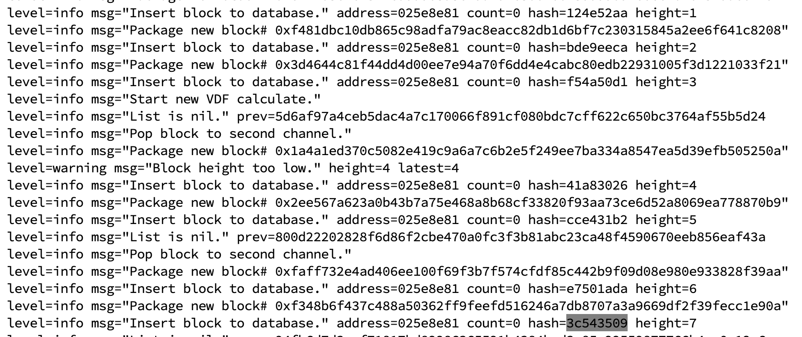
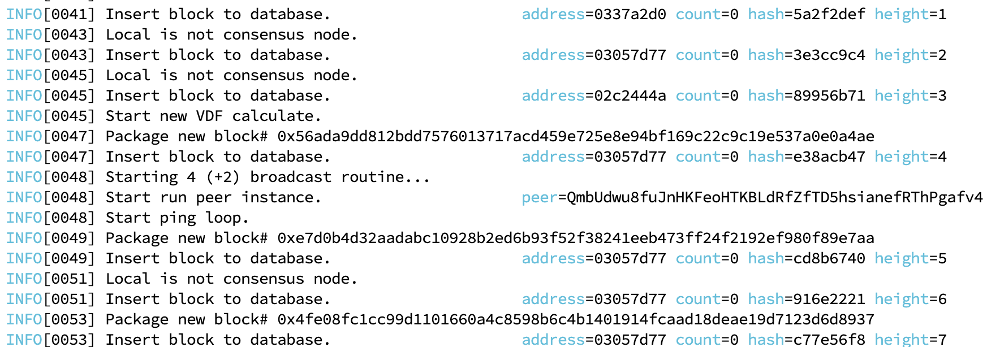
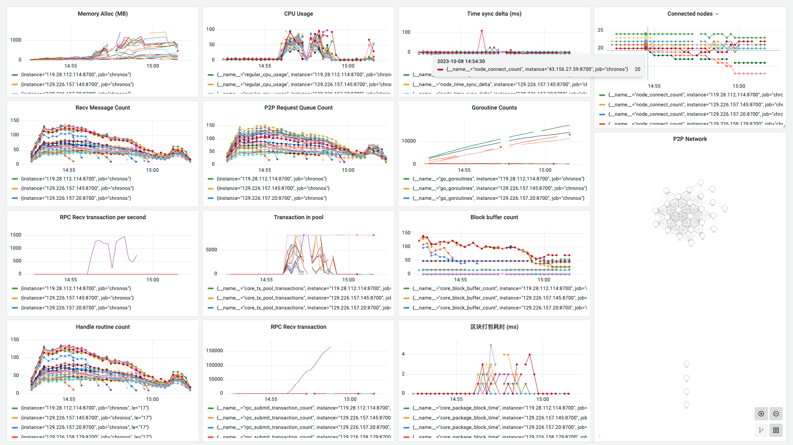

**日期**：2023.10.08

**git 版本号**：7da4de4（branch v1.0.1）

**节点数**：29 + 1

**区块打包间隔**：2s

**服务器配置**：2 Core + 2 GB 内存

**单节点连接阈值**： 20

## 版本修改

与版本号 86b9eb4 的对比

* 梳理、调整了区块同步类 Syncer 的代码逻辑以修复同步存在的问题

## 测试结果

* 区块同步的代码仍然存在问题，部分节点从开始到测试完成时的区块高度一直为 0，不能正常处理
* 分叉问题？






## 测试数据

### TPS 绘图

![[2023-10-08 15:06:11]chronos_tps](./assets/[2023-10-08 15:06:11]chronos_tps.svg)

### Grafana 相关数据



http://localhost:3000/d/BsYlvN94k/chronos-core?orgId=1&from=1696747933548&to=1696748542639&kiosk

### Graph 程序输出

```
timestamp: [970 2000 2000 2001 1999 2001 1999 2000 2000 2001 1999 2000 2000 2001 1999 2000 2001 2000 2000 2519 1480 2522 2001 1999 1478 2001 2521 1478 2000 2001 2519 1481 2000 2000 2520 1479 2523 1478 2521 2000 1478 2000 2000 2523 1998 1479 2000 2523 1477 2523 1477 2000 2000 2523 1998 1479 2530 2000 1990 2004 1477 1999 2524 1477 1999 2523 2000 2000 2000 1999 1478 2000 2522 1479 2522 1477 2001 2522 1478 1999 2000 2522 1999 2002 2000 2009 1469 1999 2000 2001 1999 2521 2000 1480 1999 2523 1477 2000 2000 2001 2522 1477 2521 1479 2521 2001 1479 2522 3478 512 2012 1475 2520 1480 2520 2002 1478 2519 2004 1997 4000 3 1478 2000 2521 1478 2001 2521 2001 1477 2522 1999 2000 2001 1478 2000 2521 3479 523 1477 2000 2001 1999 2535 1465 2523 1478 2524 5476 528 6 1999 1466 2500 1299 2706 2029 1985 1481 2001 2000 2531 2001 1986 2003 1429 2049 2002 4508 31 1463 1996 2509 2011 1363 2119 2529 2004 1226 2239 2524 1477 2521 2012 1989 1999 1479 1999 4001 533 2003 1380 4084 521 2000 2008 1992 1478 2533 1454 2543 1470 2535 3986 2014 -14 1483 1996 2003 2540 1999 1471 2518 1988 1482 6000 518 2012 2000 1195 274 2522 3478 4000 -1477 3147 2331 530 6001 1469 3999 2477 1459 64 2001 8000 2000 4000 13999]
counts: [0 0 0 0 0 0 0 0 0 0 0 0 0 0 0 0 0 0 0 0 0 0 0 0 0 0 0 0 0 0 0 0 0 0 0 0 0 0 0 0 0 0 0 0 0 0 0 0 0 0 0 0 0 0 0 0 0 0 0 0 0 0 0 0 0 0 0 0 0 0 0 0 0 0 0 0 0 0 0 0 0 0 0 0 0 0 0 0 0 0 0 0 0 0 0 0 0 0 0 0 0 0 0 0 0 0 0 0 0 0 0 0 0 0 0 0 0 0 0 0 0 0 0 0 0 0 0 0 0 0 0 0 0 0 0 0 0 0 0 0 0 0 0 0 0 1927 3883 2988 4308 225 5000 5000 4833 5000 3768 2841 2495 5000 5000 5000 2432 5000 5000 5000 5000 3419 5000 5000 5000 5000 5000 5000 4984 5000 5000 5000 5000 5000 1513 5000 5000 5000 5000 5000 3770 5000 2293 0 0 5000 5000 1268 5000 5000 5000 3290 5000 5000 5000 3780 4139 5000 5000 5000 2769 5000 5000 5000 4772 1840 3623 5000 5000 5000 5000 3567 5000 5000 5000 1216 4498 5000 2035 0 5000 4455 4023 3823 5000 5000 5000 2122 0 0 0 0 0 0 0]
total: 361899
packageAddr:  {"0209579b":1,"025b5fda":1,"02e66ca9":122,"033637b7":35,"037758c9":51,"03b8ba97":6,"03e5d141":23}
```

