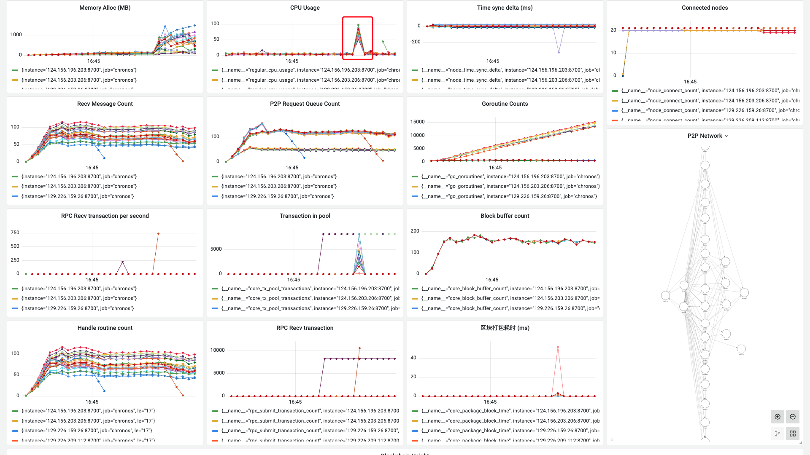

**日期**：2023.10.08

**git 版本号**：93877aa（branch v1.0.1）

**节点数**：29 + 1

**区块打包间隔**：2s

**服务器配置**：2 Core + 2 GB 内存

**单节点连接阈值**： 20

## 版本修改

与版本号 7da4de4 的对比

* 调整了区块广播的逻辑：向所有的对端节点进行广播，不使用 Ethereum 的广播方式

## 测试结果

* 找出了前几次代码存在问题的一个原因：区块广播算法存在问题，区块不能有效地到达所有节点，导致一开始就出现分叉，进一步导致：
    * 部分节点不能启动
    * 部分节点启动一段时间后无法和其他节点一起正常工作

* 另外，2C2G的配置不能很好的保证正常工作，在大量发送数据到节点之后节点停止工作（占用了大量cpu资源导致其他协程无法正常工作）


## 测试数据

### TPS 绘图

![[2023-10-08 16:54:11]chronos_tps](./assets/[2023-10-08 16:54:11]chronos_tps.svg)

### Grafana 相关数据



http://localhost:3000/d/BsYlvN94k/chronos-core?orgId=1&from=1696754528394&to=1696754959138&kiosk

### Graph 程序输出

```
timestamp: [1958 2000 714 2002 1999 2001 2001 3004 997 2001 1999 1995 2005 2001 3006 992 2001 1999 2002 1996 2001 3007 989 3010 993 2004 1998 2002 1995 2005 3003 997 3003 1999 996 3007 995 3007 989 1998 3009 997 2000 3003 990 2002 3009 989 3010 993 3013 1994 993 2004 3001 999 3008 1994 1999 999 1994 3009 2000 1998 999 3002 997 2001 3002 994 3007 2000 2009 1991 2006 1992 2012 1989 2000 1999 2000 999 3002 2011 1990 2009 1990 1999 998 3003 2000 997 3003 996 3006 2008 1992 994 3005 992 3008 995 3006 990 3009 2006 2003 986 3004 1999 2000 2001 2000 998 1995 3006 993 3026 980 1999 3002 2019 980 3003 1999 2000 998 1994 3008 992 3008 1999 2001 2000 994 2003 3002 997 3005 1999 2000 995 3005 2000 2012 1988 997 3003 992 2005 3002 2000 999 3002 998 3001 2014 1986 2011 1989 2001 2029 2249 1722 2031 1970 1998 2001 2002 2017 979 3003 1999 1999 996 3016 1989 2001 1999 2001 995 3004 1999 2000 999 1999 1999 3005 992 3007 993 3007 2000 2000 2001]
counts: [0 0 0 0 0 0 0 0 0 0 0 0 0 0 0 0 0 0 0 0 0 0 0 0 0 0 0 0 0 0 0 0 0 0 0 0 0 0 0 0 0 0 0 0 0 0 0 0 0 0 0 0 0 0 0 0 0 0 0 0 0 0 0 0 0 0 0 0 0 0 0 0 0 0 0 0 0 0 0 0 0 0 0 0 0 0 0 0 0 0 0 0 0 0 0 0 0 0 0 0 0 0 0 0 0 0 0 0 0 0 0 0 0 0 0 0 0 0 0 0 0 0 0 0 0 0 0 0 0 0 0 0 0 0 0 0 0 0 0 0 0 0 0 0 0 0 0 0 0 0 0 0 0 0 0 0 0 0 3815 1711 5000 5000 2866 5000 3040 493 5000 3225 0 3225 0 0 0 0 0 0 0 0 0 0 0 0 0 0 0 0 0 0 0 0 0 0 0 0 0]
total: 38375
packageAddr:  {"023a32c6":3,"0246bb7e":3,"02520c9d":1,"026ea080":5,"027fcf1e":40,"029b2d95":1,"02c2444a":3,"03057d77":7,"0337a2d0":3,"033b374c":78,"0340612f":4,"03837eac":3,"03b2a908":1,"03d11946":38,"03d4cd26":2,"03d953a2":3}
```

