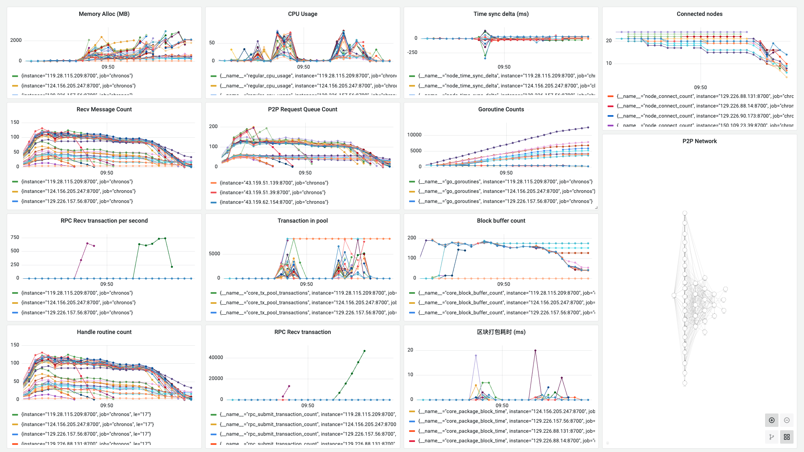
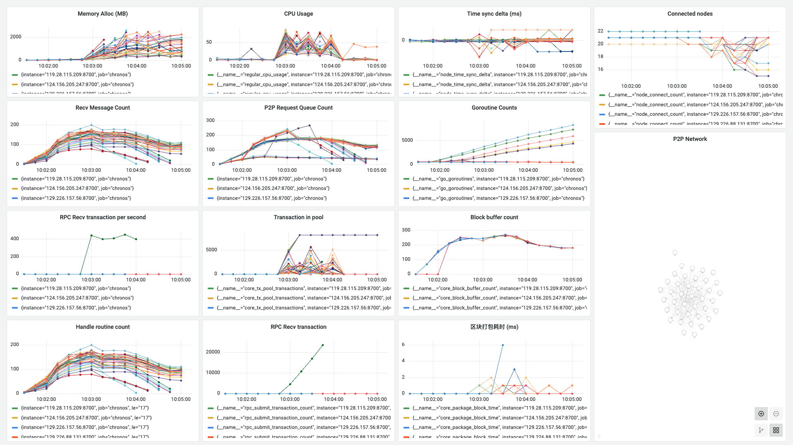

**日期**：2023.10.09

**git 版本号**：93877aa（branch v1.0.1）

**节点数**：39 + 1

**区块打包间隔**：2s

**服务器配置**：4 Core + 4 GB 内存

**单节点连接阈值**： 20

## 版本修改

无版本修改

## 测试结果

* 修改了区块广播逻辑后能够正常运行，在一段时间内区块缓冲区的同步较为一致
* 在发起交易的测试后，部分节点到一定的高度后停止运行，原因未知

>附：长安链的节点淘汰算法：https://docs.chainmaker.org.cn/tech/P2P%E7%BD%91%E7%BB%9C.html


## 测试数据

### TPS 绘图

交易打包上限 5000

![[2023-10-09 10:10:06]chronos_tps](./assets/[2023-10-09 10:10:06]chronos_tps.svg)

交易打包上限 10000

![[2023-10-09 10:11:07]chronos_tps](./assets/[2023-10-09 10:11:07]chronos_tps.svg)

### Grafana 相关数据

交易打包上限 5000



http://localhost:3000/d/BsYlvN94k/chronos-core?orgId=1&from=1696816006782&to=1696816403729

交易打包上限 10000




http://localhost:3000/d/BsYlvN94k/chronos-core?orgId=1&from=1696816888545&to=1696817114782

### Graph 程序输出

交易打包上限 5000

```
timestamp: [1387 2000 2002 1999 2000 2001 1999 2000 2000 2000 2000 2000 2001 1999 2000 2000 1998 2002 2001 2000 1999 2002 1999 2001 2000 1998 2002 2000 2000 2003 1997 2001 1999 2002 1998 2000 2000 2002 1999 1999 2000 2000 1999 2003 1997 2000 2002 2001 1998 1999 2000 2001 1999 2001 1999 1999 2005 1997 1999 2003 1998 1999 2007 1996 2003 1994 2000 2000 2001 2000 2000 2001 1999 2023 1984 2006 2088 1959 1956 1968 2343 1697 1997 1996 2000 2018 1967 1982 2026 2014 1987 2010 1994 2001 1969 2018 2009 1990 1983 2015 1985 2000 2006 1994 1999 2012 2004 1985 2000 2007 1991 2018 1993 1990 2000 2016 1992 1993 1994 2000 2016 1989 2008 2001 1999 2006 1987 1999 2016 1984 2001 2000 2015 2000 1985 2011 1988 2583 1443 1985 2002 2017 1993 2008 1999 1999 1983 1988 2583 1439 1997 1997 2014 1995 1994 1981 2030 1989 1993 2041 1965 1995 2020 1997 1982 2015 1990 4008 1 2004 6023 -27 557 1450]
counts: [0 0 0 0 0 0 0 0 0 0 0 0 0 0 0 0 0 0 0 0 0 0 0 0 0 0 0 0 0 0 0 0 0 0 0 0 0 0 0 0 0 0 0 0 0 0 0 0 0 0 0 0 0 0 0 0 0 0 0 0 0 0 0 0 0 0 0 0 0 0 0 0 0 325 2258 3872 5000 4395 3772 5000 5000 5000 2925 5000 5000 3980 5000 5000 5000 5000 4106 1101 173 2665 0 5000 1582 3225 0 0 0 0 0 0 0 0 0 0 0 0 0 0 0 0 0 0 0 0 0 0 0 0 0 0 0 0 0 0 0 0 0 0 0 0 0 0 0 753 2002 3336 2251 3767 5000 4066 3661 5000 3909 5000 3194 5000 5000 5000 3592 5000 5000 5000 2423 5000 2911 4322 5000 5000 2943 2960 3136 5000 5000 3232 5000 5000 5000 5000 5000 5000]
total: 241837
packageAddr:  {"0234cb4b":3,"027172b8":22,"027ebf85":2,"02992e1f":18,"0307cb74":24,"0308131e":2,"0309dee0":31,"0339ff9a":1,"03646142":7,"03666cb7":2,"0366df74":1,"0368c223":6,"03740ed8":1,"037a4511":2,"038d1929":10,"03929a54":5,"0392a7a9":7,"039e032c":11,"03a5761c":6,"03b16d79":3,"03b20ac0":3,"03ef2ba4":5,"03fb9d9f":2}
```

交易打包上限 10000

```
timestamp: [962 2005 1993 2006 1996 2000 1998 2002 2006 2000 2000 2000 2000 2000 2000 2000 2000 1999 1994 2006 1997 2004 2003 1992 2006 1992 2000 2005 1996 2004 2000 2000 2002 2001 1997 2001 2001 1999 2971 1030 2005 2084 1919 2141 1869 1990 2059 1941 1987 2016 2001 1999 1997 2251 1752 2245 2716 1036 1990 2007 2006 2007 2954 1027 2012 1998 2003 2958 1032 2031 1984 1984 2008 2019 2228 1755 1988 2970 1027 2004 1994 2006 1999 1995 2006 1999 2000 2002 1998 4001 4029 5970 1 3 253 -249]
counts: [0 0 0 0 0 0 0 0 0 0 0 0 0 0 0 0 0 0 0 0 0 0 0 0 0 0 0 0 0 0 0 0 0 0 0 0 0 0 1066 1771 2894 3621 4297 2249 4500 6501 4289 8649 4106 2485 4598 3062 2405 2608 5049 3377 2650 2751 6313 7254 4250 3414 5383 3099 4254 3616 3348 2133 4536 5826 5602 3926 6762 3914 5127 3222 374 51 0 0 0 0 0 0 0 0 0 0 0 0 0 0 0 0 0 0]
total: 155332
packageAddr:  {"0238e98a":6,"025aeb5b":2,"02718f2f":21,"0273b955":2,"027ebf85":1,"02829e52":2,"02cd69ab":1,"02dda007":1,"02f43942":1,"033759b6":2,"0339ff9a":1,"03646142":2,"03666cb7":1,"0366df74":2,"0368c223":4,"03740ed8":1,"037a4511":3,"038d1929":4,"0390448a":1,"03929a54":3,"0392a7a9":10,"03a5761c":2,"03b16d79":1,"03b1f59a":6,"03b20ac0":3,"03cdc16d":7,"03d856da":4,"03ef2ba4":2}
```

