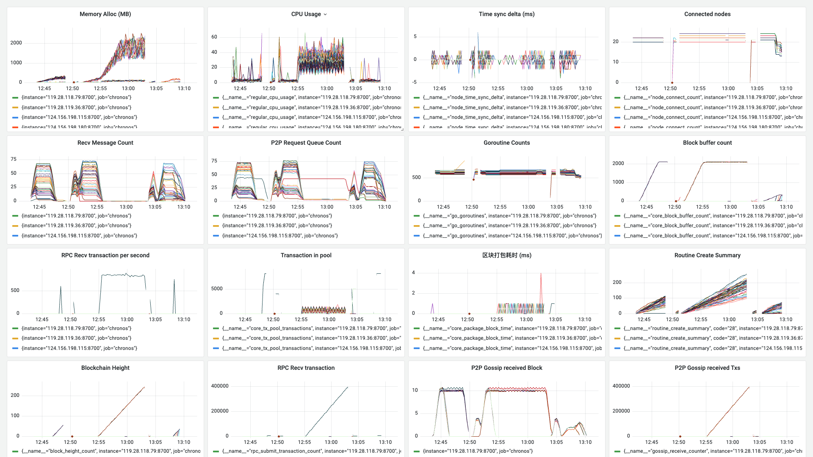
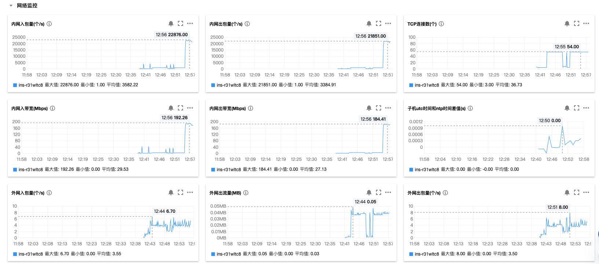

**日期**：2023.10.16

**git 版本号**：9cec726（branch v1.0.1）

**节点数**：49 + 1

**区块打包间隔**：2s

**区块缓冲区大小**： 100

**服务器配置**：4 Core + 4 GB 内存

**单节点连接阈值**： 20

## 版本修改

与版本号 93877aa 的对比

* 调整了区块广播的逻辑：利用 go-libp2p 的 gossip 协议进行广播

* 修改了时间同步逻辑的实现

    > 原有的逻辑是 2s 请求一次，在本次请求后等待响应再进行下一次请求。然后超时时间 5s，如果超过该时间没有响应则重新选择节点请求
    >
    > 现在直接每隔 2s 请求一次进行同步，不管是否响应都进行请求，然后处理响应的函数正常处理

* 修复了 Gossip 的使用方法，`NewGossipSub` 方法创建的 gossip 是一个单例，只能使用不同的 topic 来进行划分，类似地，这样会出现区块和交易在同一个信道的问题，但是测试后发现广播比较可靠且效率高（原来的广播方法网络开销较大）

## 测试数据

### Grafana 相关数据

http://localhost:3000/d/BsYlvN94k/chronos-core?orgId=1&from=1697431302319&to=1697433136562

### 带宽数据

