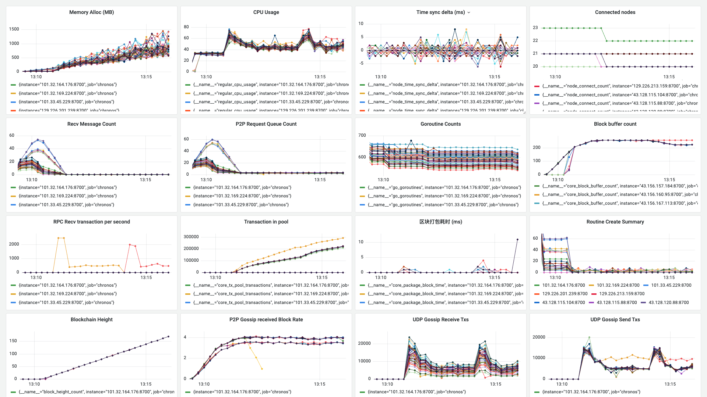

**日期**：2023.10.30

**git 版本号**：0343d0f（branch v1.0.1）

**节点数**：49 + 1

**区块打包间隔**：2s

**区块缓冲区大小**： 32

**VRF 选取阈值**： 0.75（选取节点概率 25%）

**服务器配置**：4 Core + 4 GB 内存

**单节点连接阈值**： 20

## 版本修改

与版本号 9cec726 的对比

- 使用 UDP 来进行交易的广播


## 测试结果

* VDF 的计算类存在问题，之前的版本下会频繁更改计算结果，修复后不更新计算结果
    
* UDP 广播需要进行优化，而且 RPC 在一段时间后接受交易的速度降低

## 测试数据

### TPS 绘图

![[2023-10-30 13:16:35]chronos_tps](./assets/[2023-10-30 13:16:35]chronos_tps.svg)

### Grafana 相关数据



http://localhost:3000/d/BsYlvN94k/chronos-core?orgId=1&from=1698642562945&to=1698642967907&kiosk

### Graph 程序输出

```
timestamp: [13613 8 1993 6 1993 8 1990 2 8 1990 10 1991 2001 1998 2001 2000 2000 2000 2000 2000 1999 2001 2000 2000 2000 2000 2000 2000 2000 2001 2000 1998 2000 2001 1999 2002 1999 2000 1999 2000 2000 2001 2000 2011 1990 2010 1989 1999 2010 2000 2002 1988 2010 1990 2002 2010 1991 1998 1999 2002 2009 1990 2000 2000 2000 2000 1999 2001 2000 2001 1999 2000 1999 2001 2001 1999 2000 2000 1999 2003 2000 2000 1999 2001 2001 1999 1998 2001 2001 2000 1999 2000 2001 1995 2003 2000 2001 2004 1999]
counts: [0 0 0 0 0 0 0 0 0 0 0 0 0 0 0 0 0 0 0 0 0 0 0 0 0 0 0 0 0 0 0 0 0 0 0 0 0 0 0 0 0 0 0 1408 3468 2665 3124 2770 3038 2759 2825 2804 2894 2893 2864 2812 2886 2721 664 10 1 0 0 0 0 0 0 0 0 0 0 0 0 0 0 0 0 0 0 0 0 0 0 0 0 0 0 0 0 0 0 0 0 0 0 0 0 0 0]
total: 42606
packageAddr:  {"02323c2f":1,"027ec20c":1,"02da891b":9,"02f351e5":7,"032a8ee2":4,"03af5118":67,"03d05993":10}
```

```
timestamp: [11695 1 1999 1 1999 4 1996 21 1979 2 1998 2000 2000 2000 2000 2000 2000 2001 1999 2000 2000 2000 2000 2000 2000 2001 1998 2000 2001 2000 2000 2000 2000 2000 2000 2002 2000 1997 2002 2000 2000 2001 1999 1999 2001 2000 1998 2023 1982 2018 1982 1997 2003 2018 1993 2007 1995 1987 2000 2017 1993 2007 1996 1984 2016 2001 1983 2020 2001 1999 1980 2016 1984 2017 1983 2003 2004 2006 1990 2000 1997 2004 1999 1998 2012 1990 1998 2021 1995 1984 2004 2016 1978 2007 1999 2017 1994 2007 1997 2002 1982 2002 1998 2012 1985 2005 2009 2001 1985 2005 2000 2009 2007 1983 2017 1997 1982 2013 1990 2001 2017 1979 2006 2007 1985 2005 2005 2006 2007 1986 2009 2005 2000 1993 1991 2016 1999 2001 1984 2015 1980 2021 1981 2011 2008 1979 2021 1981 2019 1977 2023 1983 2000 2000 2009 2002 1998 1985 2005 2010 2001 1988 1996 2017 1991 1994]
counts: [0 0 0 0 0 0 0 0 0 0 0 0 0 0 0 0 0 0 0 0 0 0 0 0 0 0 0 0 0 0 0 0 0 0 0 0 0 0 0 0 0 0 0 0 0 0 0 3483 2811 3099 3062 2912 2965 2864 2975 2790 2977 2902 2965 2978 2774 1940 1746 1721 1732 1707 1685 1779 1719 1772 1821 1764 1850 1788 1819 1889 1685 1768 1625 1610 1588 1189 1166 1040 959 1036 1061 1008 1014 986 1005 1059 1006 957 963 980 925 993 952 971 1024 1062 1078 1094 1085 1043 983 1092 1013 1077 1001 1017 999 959 960 1003 1013 1023 1022 1042 1009 1005 1111 1062 1020 1079 1033 1004 1015 995 1028 1055 1023 1069 1037 1132 993 1101 993 1068 1009 1010 991 996 2045 4020 3354 3593 3233 3436 2598 2677 2666 2773 2979 2738 1869 1739 1756 1809 1702 1502 1786 1472 1620 1553]
total: 194183
packageAddr:  {"0282542c":17,"02a08861":13,"02add5a7":13,"02b2e890":14,"02da891b":15,"02f31279":13,"0396933a":18,"03e3156e":63}
```

