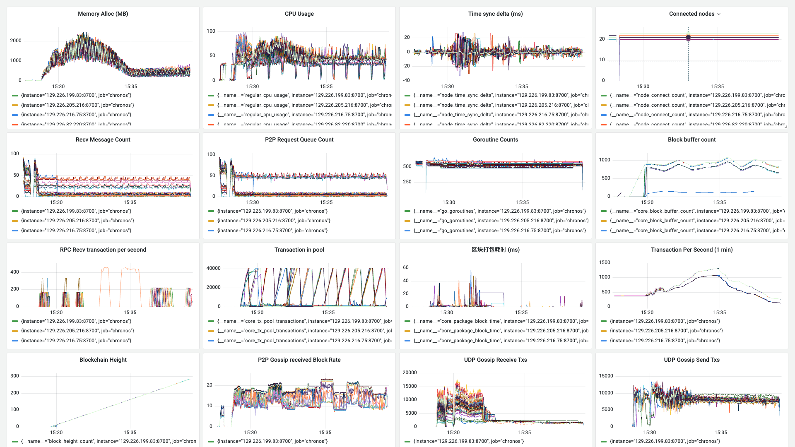

**日期**：2023.11.03

**git 版本号**：fcadce8（branch v1.0.1）

**节点数**：49 + 1

**区块打包间隔**：2s

**区块缓冲区大小**： 32

**VRF 选取阈值**： 0.3（选取节点概率 70%）

**服务器配置**：4 Core + 4 GB 内存

**单节点连接阈值**： 20

## 版本修改

与版本号 0343d0f 的对比

- 修复 VDF 计算问题

    > VDF 在 branch v1.0.1 - e0d2c91 中的计算方式没有对上一次的输出进行拷贝，导致在验证的时候修改了对应的变量

- 修复节点在开始接收交易后无法广播区块的问题

    > go-libp2p 限制了广播消息的大小为 1M，调整这个值为 4M 后正常工作，在此之前 TPS 无法达到当前的高度也有这里的原因
    >
    > ```golang
    > const pubsubMaxSize        = 1 << 22 // 4 MB
    > 
    > ...
    > 
    > pm.gossip, err = pubsub.NewGossipSub(ctx, h,
    >     pubsub.WithMaxMessageSize(pubsubMaxSize),
    > )
    > ```

- 修复对 VDF 的验证和释放的问题，在 `go-chronos/core/buffer.go:263` 和 `go-chronos/core/buffer.go:149` 添加了处理逻辑，如果区块校验失败后要释放锁，否则在打包区块时无法获取到锁；

- VDF 在变化时保留上一次的值用于验证，避免由于延迟使得其他区块到达后无法正常校验；


## 测试结果

* 交易的接收和广播还是存在问题，测试到后期无法正常接收大量交易
  

## 测试数据

### TPS 绘图

![[2023-11-03 15:44:10]chronos_tps](./assets/[2023-11-03 15:44:10]chronos_tps.svg)

### Grafana 相关数据



http://localhost:3000/d/BsYlvN94k/chronos-core?orgId=1&from=1698996462466&to=1698997155466

### Graph 程序输出

```
timestamp: [11215 2 4 8 4 1008 975 1025 2985 1989 2009 1017 2986 1999 2002 2006 1999 2003 1007 2000 2989 1012 2004 2972 2010 1989 1999 2000 2000 2000 1022 2992 1010 2000 2977 1023 2978 1029 2977 1996 1020 2001 1999 2990 2000 2000 1011 2973 1026 2977 1024 2993 2000 1993 2001 2000 1987 1991 2015 1997 1999 1031 2970 1999 1984 2029 1008 2991 1973 1043 2987 1979 1026 2992 2002 1006 2978 2002 2013 1007 2001 2994 2002 1996 1975 2016 1015 2969 2023 2000 1993 1987 2014 1023 2000 2984 1011 2981 1995 2005 2000 1994 1989 2009 2001 2014 1989 2007 2000 2000 1991 2003 2000 1748 2000 2253 2008 2000 2000 1999 2000 2000 1995 2000 2000 2000 2000 2000 2000 2000 2000 2001 1998 2008 1009 2002 2002 2985 2001 1998 2000 2000 2001 2001 1999 2001 2000 2000 2000 2001 2006 1999 1995 2001 2003 2002 1992 2008 1997 1996 1999 2008 1983 2006 2010 1999 2000 2000 2001 1986 2006 2001 2002 1999 2000 1998 2002 2000 2001 1999 2001 2000 1998 2000 2003 2000 2000 1997 2000 1999 2000 2001 2003 1997 2001 1999 2000 2001 1999 2000 2002 2000 2000 1999 2001 1998 2000 2000 2002 1999 2000 2000 2000 2006 2001 1996 2004 1999 2001 2000 2000 2000 2000 2001 1999 2000 2000 2001 2000 2000 2000 1999 2001 1999 1993 2000 2003 1996 1993 1020 2980 1999 1998 2013 1990 2001 1018 2995 1003 2997 1990 2008 2000 2004 1983 2001 1998 2010 2003 1994 2005 1991 1999 2000 2000 2007 2004 2000 1011 2987 1997 2001 2007 1992 2000 2006 2000 2000 1998 2001 1999 2002 2000 2001]
counts: [0 0 0 0 0 0 0 0 1975 3316 7842 2848 2088 10000 7595 2929 2903 7453 3441 1489 3144 3008 2120 1566 10000 10000 10000 10000 10000 7927 3546 4737 2371 2225 2228 2296 2388 2228 2322 2215 2267 2189 521 13 14 20 0 6 9 27 46 4540 1543 4786 4593 831 3449 5262 4145 3322 3731 1943 3231 3438 3981 2409 2813 2622 2322 3241 1392 1167 1195 1154 561 594 563 507 845 3602 7036 5994 3430 2405 2471 2567 2950 3340 3437 3129 4381 3952 3930 2059 3539 2064 2169 2600 2194 2733 2858 2847 4238 4149 4285 3509 3203 3838 5756 6291 3556 4238 4652 2949 2835 2135 2151 2082 1932 1675 1504 1342 1071 938 699 792 575 634 611 525 543 321 237 1071 952 821 566 3491 951 984 967 863 945 969 941 902 950 899 918 914 142 141 134 128 106 124 130 131 115 142 113 140 224 366 122 120 131 116 129 131 134 85 233 912 928 912 877 917 921 883 909 910 918 909 927 879 869 909 887 893 916 905 894 895 871 859 883 896 883 880 890 876 875 845 864 881 572 884 871 867 915 913 579 134 89 126 100 111 101 111 107 84 109 103 91 112 61 84 106 107 118 130 157 141 714 901 442 122 212 117 2014 795 883 822 903 278 4 502 2006 625 15 33 33 86 675 876 520 123 76 66 95 830 978 695 933 692 1003 699 435 897 730 827 522 53 107 111 166 108 87 161 188 238 90 171]
total: 455901
packageAddr:  {"021c5c32":12,"023cc5fd":2,"023e787c":2,"023ea55f":2,"023ed18a":3,"02455a96":3,"0248c70e":1,"027732ca":4,"027d29d5":13,"027fd2e2":1,"02941d41":5,"02962a61":5,"02a1bdde":11,"02a2a485":7,"02b0783d":2,"02b73eb5":4,"02f9b726":2,"02fda35a":26,"02fffae1":5,"0301b221":10,"030e5cc4":4,"0310c773":10,"03132f9a":2,"031b4e08":4,"0337bbc2":60,"034085be":2,"03513617":6,"0368dc65":10,"037faf63":5,"0392ca20":4,"03b34e61":44,"03c92c91":5,"03fea06e":8}
```

