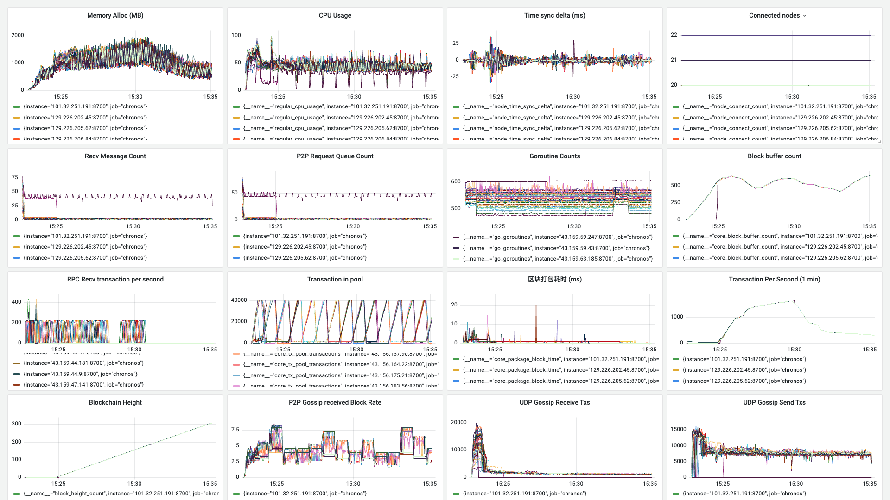

**日期**：2023.11.08

**git 版本号**：fcadce8（branch v1.0.1）

**节点数**：49 + 1

**区块打包间隔**：2s

**区块缓冲区大小**： 64

**VRF 选取阈值**： 0.8（选取节点概率 20%）

**服务器配置**：4 Core + 4 GB 内存

**单节点连接阈值**： 20


## 测试结果

* 交易在测试到后期时降低到原因是交易池设计的问题

## 测试数据

### TPS 绘图

![[2023-11-08 15:39:14]chronos_tps](./assets/[2023-11-08 15:39:14]chronos_tps.svg)

### Grafana 相关数据



http://localhost:3000/d/BsYlvN94k/chronos-core?orgId=1&from=1699428169600&to=1699428921118

### Graph 程序输出

```
timestamp: [12577 2010 1989 2010 1991 2000 2000 2011 1989 2000 2014 2000 2000 2000 2000 1980 2010 2000 2002 1997 1990 399 1602 394 1608 392 1632 368 1605 394 1606 397 1997 2000 1607 2001 2015 1997 2000 2004 1995 2008 1997 2000 2003 1996 2000 2000 2000 1986 2014 1997 1996 1993 2002 2000 2016 2006 2005 2000 2001 2001 2000 1998 2001 2000 1999 2001 2000 2002 1988 2002 2000 2008 2000 2001 2001 1990 2000 1999 1986 2011 1991 2016 2003 1991 1991 1992 2010 1997 2002 2004 2013 1983 1990 2016 1992 2006 1988 2033 1990 1999 1985 2000 2000 2007 2014 2000 1987 2006 1991 2002 1999 2014 1999 1991 2000 2001 2001 2000 1990 2000 2005 2000 1997 2001 1999 2000 2000 2012 1999 2001 1994 2001 1999 1981 2019 2006 1995 1989 2000 2010 2005 2000 2002 1998 1995 1986 2018 1975 2021 2004 2000 2001 1977 1999 2000 2003 2001 2000 2000 2005 2000 2000 2000 2001 2006 1993 2003 2007 1997 1995 2014 1987 1999 1999 2003 1998 2003 1989 2000 2007 2000 2010 2001 1987 1994 2018 1999 1989 2000 2000 1993 1997 2000 2016 2004 2000 1986 2000 2000 2024 1988 2012 1994 1978 2020 2000 1991 1999 1999 2000 1999 2001 1994 2016 1987 2384 1612 1998 2019 1990 2011 1998 1991 1992 1999 2000 2006 2003 1999 2011 1991 1992 2018 1983 2000 2016 1996 2000 2000 1999 2005 1986 2016 1987 2005 2000 1997 2013 1983 2005 1999 2000 2011 1984 1998 2019 1995 2004 1999 2003 1999 2001 1995 2000 1997 2004 1992 2006 1997 2001 2001 1999 2008 1992 1998 2010 1991 2003 1997 2000 2001 1997 1996 2000 2001 2014 1998 1997 2000 1994 2000 2008 1993 2000 2000 2010 1992]
counts: [5033 9227 3799 3029 10000 10000 4138 3551 3980 3346 10000 10000 10000 9780 8774 6900 9343 9174 10000 10000 10000 10000 10000 10000 10000 8678 8956 5304 6470 7621 6521 9812 10000 10000 6303 5978 2167 2233 2259 2206 2165 2202 2263 2161 2234 2189 2218 2197 2219 2217 2202 2300 10000 10000 10000 10000 9288 6796 6047 3489 3544 3421 3429 3396 3320 2986 2069 1879 1808 1913 1615 1790 1816 1374 1244 1236 1165 1119 910 991 1956 2262 1506 2177 1662 400 898 1144 997 526 525 572 563 596 583 580 560 528 407 633 1114 1180 395 355 316 1438 1542 3182 2121 1754 1419 531 505 534 562 591 597 1256 1195 668 554 482 502 503 428 359 385 413 450 404 466 484 1398 1885 1997 2148 1840 557 540 510 482 514 583 527 498 504 440 398 386 389 445 538 509 483 1035 1168 866 960 1378 1680 1412 2203 573 621 604 545 513 536 513 487 427 446 467 435 475 416 403 430 491 531 493 519 485 2791 2627 1774 1926 1946 485 515 1103 1088 1009 1218 579 374 406 398 595 1147 1180 445 417 405 438 427 472 488 1334 1615 1431 1426 1580 368 354 348 370 362 362 370 367 419 415 483 469 629 1266 933 410 426 434 457 435 368 1641 3206 1768 1668 1634 362 432 379 377 383 407 463 398 401 330 348 400 429 389 392 365 333 311 285 1035 1113 846 1336 1344 1197 324 301 323 362 334 311 329 306 367 377 376 366 330 275 279 255 255 287 305 282 847 736 1000 1826 1016 287 298 261 256 263 309 317 326 337 300]
total: 592616
packageAddr:  {"02069463":13,"02240c77":4,"022b11c5":1,"022b2c35":9,"0231b71f":10,"023243ff":2,"023e256a":3,"0241b761":2,"0245a620":1,"0247b732":7,"02502d7f":6,"025994fd":8,"025ae5f5":12,"025d7179":1,"0261c934":10,"02629c3f":18,"02681ff5":4,"027fb595":5,"029a5559":8,"02aeca07":6,"02d4694f":2,"02e12446":1,"02f37c91":5,"03051843":7,"030f5a14":7,"031d42cc":34,"034502aa":5,"035be7b1":3,"0360e529":8,"03622c84":31,"0381efb9":1,"039c8557":9,"03a03e20":3,"03a2d077":30,"03a3fe0b":9,"03a5dbe6":3,"03a5ecf0":8,"03bdb2d5":3}
```

