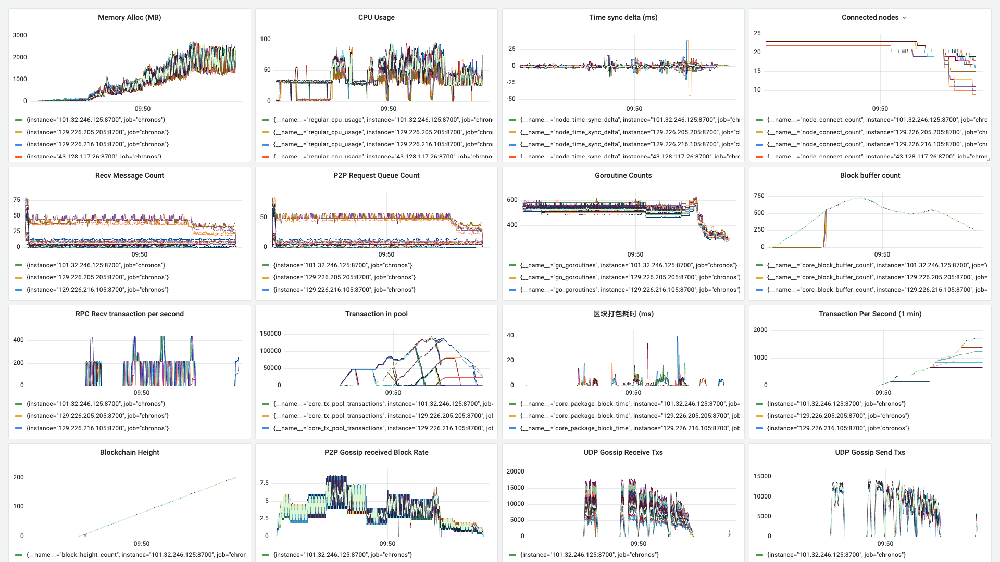
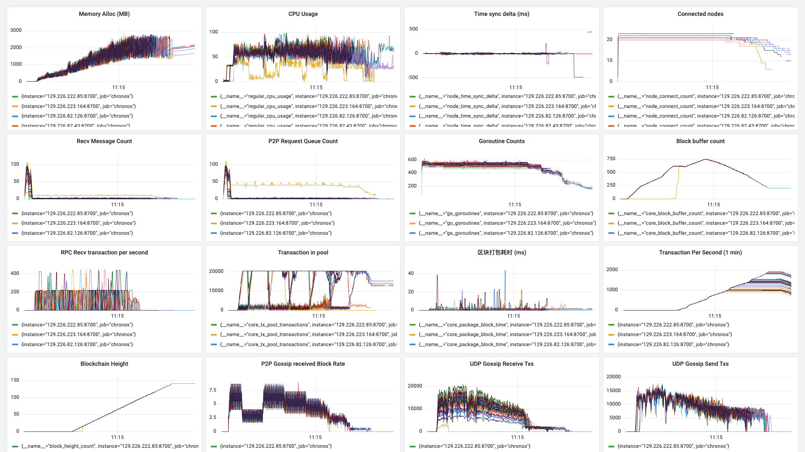

**日期**：2023.11.13

**git 版本号**：94e2a00（branch v1.0.1）

**节点数**：49 + 1

**区块打包间隔**：2s

**区块缓冲区大小**： 64

**VRF 选取阈值**： 0.8（选取节点概率 20%）

**服务器配置**：4 Core + 4 GB 内存

**单节点连接阈值**： 20

## 版本修改

与版本号 fcadce8 的对比:

* 将交易池打包的逻辑改为遍历 sync.Map，原有的逻辑是直接使用 channel 读取队列头的数交易


## 测试结果

* 通过 RPC 发送交易会在某个节点卡住，需要设置超时时间

## 测试数据

### TPS 绘图

1. 未修改交易发送程序超时重连的逻辑，以及没有添加交易池上限时的 TPS 绘图

![[2023-11-13 09:56:03]chronos_tps](./assets/[2023-11-13 09:56:03]chronos_tps.svg)

2. 添加了超时逻辑，并且设定了交易上限

![[2023-11-13 11:21:06]chronos_tps](./assets/[2023-11-13 11:21:06]chronos_tps.svg)

### Grafana 相关数据



http://localhost:3000/d/BsYlvN94k/chronos-core?orgId=1&from=1699839911343&to=1699840457874



http://localhost:3000/d/BsYlvN94k/chronos-core?orgId=1&from=1699845031030&to=1699845520694&kiosk

### Graph 程序输出

```
timestamp: [10570 3 6 4 1987 3 5 1992 2000 1999 2000 2001 2000 2000 2000 2000 2000 2001 1999 2000 2002 2001 1997 2001 2000 2000 2000 1999 2001 1999 2001 2000 2000 1999 2000 2001 2000 1998 2002 2000 1999 2000 2000 2000 1997 2000 2000 2000 2001 2000 1999 1999 2000 2001 2000 2000 1999 2001 2000 1999 2000 2001 2000 2000 1999 2002 2000 2000 1998 2001 2001 2000 1999 2000 2407 1605 2395 2000 1595 2406 1999 1597 2403 2000 1594 2406 1598 1995 2407 1598 1996 2009 1991 2000 2005 1995 2001 1999 2001 2004 1995 2001 1999 2001 1999 2001 1998 2000 2000 1999 2001 2000 2000 2000 2000 1999 2001 2000 1997 2001 2000 2000 1998 2000 2009 2002 1990 2001 2000 1999 2000 2000 2011 2000 1987 2013 1995 1999 2006 1999 1988 2006 2000 1993 2013 1997 1998 2001 1998 2001 1999 2005 2000 1999 2000 1999 2000 2001 1998 1999 2004 2002 1994 2003 1998 2003 2000 2000 1997 2002 1998 2003 1998 2003 2001 1998 2000 2000 2000 2004 2000 1994 2003 2000 1999 2002 2005 1991 2005 2005 1989 2006 1997]
counts: [0 0 0 0 0 0 0 0 0 0 0 0 0 0 0 0 0 0 0 0 0 0 0 0 0 0 0 0 0 0 0 0 0 0 0 0 0 0 0 0 0 0 0 0 0 0 0 0 0 0 0 0 0 0 0 0 0 0 0 0 0 0 0 0 0 0 0 0 0 0 0 0 0 0 2555 3399 3124 3243 2335 2568 2902 3295 3262 1641 3430 3218 3085 3081 3102 3247 2044 1 0 0 10000 10000 10000 10000 10000 8015 0 0 0 0 0 0 0 0 0 0 0 0 0 0 0 0 0 0 10000 10000 10000 10000 10000 3684 3580 3574 1680 0 0 0 0 0 2004 3534 3330 3110 3294 3403 3363 2977 3326 3300 3108 2193 2 10000 10000 10000 10000 10000 10000 9804 9988 8447 2927 3354 2311 4 0 0 2050 2723 3322 2769 3165 61 1514 3128 2230 1504 3810 2340 2906 2771 10000 10000 10000 10000 10000 10000 10000 10000 10000 10000 10000 10000 9993 10000 8467 2968 1789 1591 3539]
total: 496484
packageAddr:  {"0228cc43":1,"022abf33":11,"025f8a49":21,"026370b2":2,"02671f7a":9,"027e78cb":6,"028a8af4":6,"028be817":2,"02988eaa":13,"02b6c90b":1,"02c2b1c8":2,"02f10757":1,"02f6160d":8,"02f9ec05":1,"030bbf55":12,"0314189f":27,"032eea1b":2,"0340e6c7":1,"034171ac":2,"0381deef":3,"0391f26a":3,"0394102d":17,"039deb93":1,"03c7840f":35,"03e06d7e":6}
```

```
timestamp: [10687 2000 2000 2 1997 1 3 1997 0 1999 4 1997 2000 1999 2001 2001 1999 2000 2000 2000 2003 2000 2000 2002 2000 2000 2000 2000 2000 2000 2001 1999 2000 2000 2002 1998 2000 2001 2000 2000 2000 2000 3995 2001 2001 1998 2000 2000 2000 2000 2000 2000 2001 1999 2001 2000 2001 1997 2001 2000 1998 2000 2001 2000 2000 2000 2000 2002 2005 1998 2000 2000 2001 2000 2000 2003 2000 2000 1998 2000 2000 2000 2000 2000 2000 2000 2000 2000 2000 2000 2000 2000 2000 2000 2000 2000 2003 1996 2001 2002 2000 1996 2000 2000 2000 2000 2005 2000 2000 2009 2000 1990 1996 2001 1999 2004 1996 2004 2000 2014 1994 2006 2000 2000 1993 1983 2000 2003 2001 2009 2003 2000 2000 2000 2000 1986 2000 2000 1999 2000 2000 1993 1999 2000 2001 2003 2000 2003 2001 2000 2000 2000 2000 14 1999 2000 2000 2000 2000 2000 2001 1996 2000 2004 1995 2000 2011 1989 2000 2000 2000 2000 2006 1996 2000 1998 2002 1998 2000 1997 2000 2000 2001 1999 2000 2000 2001 2002 2000 2000 2000 2000 1997 1999 2002 1995 2001 2000 2000 2000 1996 2005 2003 2002 1993 2005 2000 2000 2001 2000 1999 2005 1996 2000 1999 2005 1995 2000 2004 1996 2004 1998 2001]
counts: [0 0 0 0 0 0 0 0 0 0 0 2 1 0 0 2 1 0 0 0 6 6 0 0 0 0 0 0 0 0 0 0 0 0 0 0 0 0 0 0 0 0 6 0 0 207 3622 1686 3367 1676 3449 3264 3192 1609 3485 1437 986 2655 1705 3330 3098 3234 3220 3113 2531 3591 3298 3113 10000 10000 10000 10000 10000 10000 10000 9285 2179 3267 3851 3718 2744 3847 2417 2511 2986 3301 3937 4044 3656 4349 4226 3655 3326 3401 3387 3450 10000 10000 10000 10000 9999 10000 10000 10000 10000 10000 10000 10000 10000 9998 9931 3503 2125 2184 2819 4056 2914 3514 5243 2825 3052 2664 2716 2740 3833 9310 9410 9410 9197 9298 9176 9158 9166 9218 9229 9242 9077 8961 6358 4242 4191 5246 5493 4988 5309 5355 4921 1589 1730 1607 1632 1628 1616 9242 9269 9209 9151 9107 9036 8931 8856 8602 3927 1588 1638 1513 1539 1534 1415 1480 1391 1380 1448 1856 1631 1217 1288 1218 1297 7908 8597 8370 8462 8108 7673 7482 3787 1021 1085 1045 1093 973 905 937 940 927 922 858 764 788 676 632 635 556 589 5757 5546 5257 4630 656 379 353 341 317 318 386 809 1145 367 242 205 316 768]
total: 790590
packageAddr:  {"0224f1bd":27,"0248d263":26,"027e9e9a":14,"02bd4c7b":32,"03044a6d":2,"030af1a0":21,"031df1b7":1,"032bb753":41,"032e22d8":1,"0343c75e":33,"03aac534":2,"03c3dc2b":15,"03d93646":4,"03e44188":4}
```

```
timestamp: [10687 2000 2000 2 1997 1 3 1997 0 1999 4 1997 2000 1999 2001 2001 1999 2000 2000 2000 2003 2000 2000 1999 2001 1998 2001 1999 2003 1997 2001 1999 2000 2001 1999 2000 2001 1999 2002 1999 2001 2000 2006 1993 1999 2001 2010 1999 2000 2000 1999 2002 1998 2000 2000 2001 1999 1992 2014 1996 1991 2008 1999 1999 1999 2002 2000 2001 1990 2000 58001 2000 2001 1999 2000 2004 1997 1999 2000 2003 1999 2000 2000 2000 2008 2000 2000 1988 2000 2000 2002 2000 2000 2000 2010 2000 2000 2000 1277 2000 2000 2000 2000 2000 2006 1994 2001 1999 2000 2000 2000 2003 1997 2000 2000 2001 1999 2000 2000 2000 2001 2001 1998 2000 2001 1999 54000 717 1283 717 1283 715 1285 715 1285 715 1285 715 1285 715 1285 715 1285 715 1285 715 1290 711 1284 720 1280 715 1286 714 1285 715 1285 715 1285 715 1285 711 1289 711 1289 711 1289 715 1285 715 1285 710 1290 715 1285 715 1286 1999 2000 2000 2000 2000 2000 2001 2000 1999 2015 1985 2001 1999 2000 2000 2001 1999 2001 1999 2001 1999 2001 1999 2001 2712 2000 2000 2000 2001 1995 2007 1996 1999 2000 2000 2000 2002 2000 2000 2000 2000 1999 1998 2000 2003 2002]
counts: [0 0 0 0 0 0 0 0 0 0 0 2 1 0 0 2 1 0 0 0 6 6 0 0 0 0 0 0 0 0 0 0 0 0 0 0 0 0 0 0 0 0 6 6 0 0 225 3615 1685 3359 1680 3444 3265 3216 1612 3468 1446 979 2653 1723 3309 3115 3305 3208 3132 2541 3570 3312 3146 3101 10000 10000 10000 10000 10000 10000 10000 10000 10000 10000 10000 10000 10000 9780 2839 2167 2504 4385 3031 2357 2636 2991 2869 3260 2805 2508 2525 2516 9455 9418 9387 9380 9311 9297 9171 9091 9096 9075 9015 8887 8651 8411 8069 5968 5543 4456 1381 1332 1318 1291 1140 1109 1251 1155 1111 1112 3024 3553 2732 3336 1323 3109 327 1435 286 227 303 285 263 352 275 309 247 281 260 369 259 276 227 236 163 192 153 227 130 217 132 156 167 199 109 132 75 79 337 74 952 132 371 216 252 168 170 179 152 117 125 128 911 575 118 114 172 143 201 193 181 153 179 230 107 91 77 190 250 230 191 262 205 204 267 973 978 1049 999 988 508 150 220 341 415 267 226 118 147 168 243 174 227 166 258 265 326]
total: 450441
packageAddr:  {"020d6789":9,"0248d263":3,"027e9e9a":14,"02899e77":1,"02d6cd61":78,"03044a6d":3,"03098aef":11,"031b8e3c":1,"031df1b7":18,"032f4c6b":9,"03487406":71,"03a9e47b":1,"03aac534":2,"03c3dc2b":2}
```

```
timestamp: [12062 8 6 8 11 6 16 1946 1999 1997 2038 2006 1956 2059 2024 1958 1996 1965 2057 1937 2076 1982 1995 2014 1996 1965 1999 2001 1977 2023 1977 2061 1936 2086 1953 1946 2042 1964 2067 1983 1947 2071 1989 1992 2010 1990 2009 1957 2057 1984 1939 2061 1984 2029 1987 1968 2000 2002 2023 2880 1112 2019 2869 2000 1097 2903 1103 1993 2904 1137 2000 1941 2053 2003 1999 2867 1051 2041 2022 2031 1987 2025 2843 2000 1175 1918 2000 2000 2046 1992 1994 2008 1964 2033 1998 1979 1998 2029 1975 2015 1996 1992 1982 2008 1999 2071 2015 1944 1986 2002 2011 1980 1997 2000 2042 1960 2000 2001 1999 2018 1992 1992 2022 1925 2071 1977 2023 2000 1991 2011 1994 2000 2002 2004]
counts: [0 0 0 0 0 0 0 0 0 0 271 3639 2974 3082 3060 3053 3214 3226 2978 2790 1977 3511 2862 3099 10000 10000 10000 7499 3747 3991 2434 3532 2583 2319 3544 3884 3731 3348 3871 3052 3670 3556 3922 5042 3546 3874 3710 3553 3092 3837 3341 3243 3789 3741 10000 10000 10000 5730 3202 3143 3733 4515 3147 3399 3067 2104 3485 2943 4084 3936 4418 3623 3246 3442 4145 3097 4401 3310 3178 3884 3326 3052 2885 5251 10000 10000 10000 5865 2816 4354 2692 3426 5302 3420 3791 2926 3112 2810 2974 2746 5488 4862 2920 3901 3124 3025 2910 3175 3851 3094 4146 4524 4284 5347 9999 10000 10000 5045 2503 3369 3134 4406 3695 3482 4959 3929 2526 5700 3928 3945 4347 3771 6312 5055]
total: 527923
packageAddr:  {"02085e16":7,"020a6c7e":3,"022c4760":2,"022ff187":3,"0237cad1":7,"023fc506":1,"02711237":4,"0281d52d":11,"02938a54":2,"02c3f0a8":3,"02c80df1":3,"02d69dc2":5,"02f19312":8,"030f04a6":5,"0321ba4c":2,"0329cda3":5,"035e82fa":6,"03611025":1,"036bd86b":7,"0377ac8f":3,"03842fd1":3,"038b41d6":8,"038ca8a4":9,"038d312c":2,"038e892b":9,"03af28dd":2,"03c43b11":1,"03c8abbc":1,"03cdbf00":1,"03daa35b":5,"03f7d076":2,"03ffdda4":3}
```

