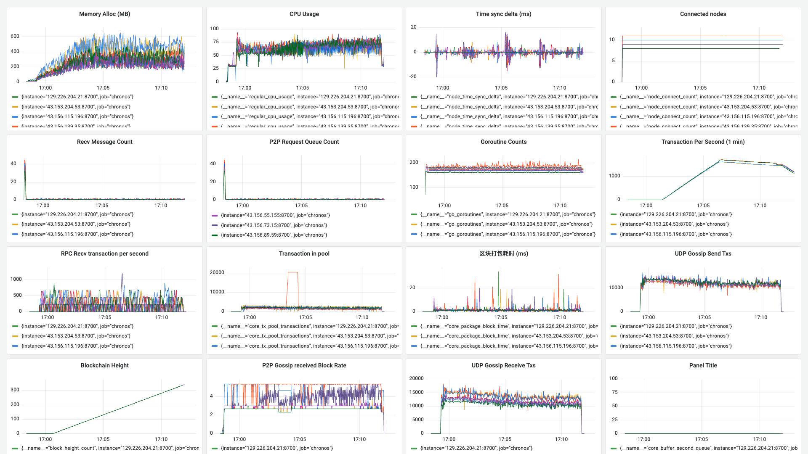

**日期**：2023.11.23

**git 版本号**：eaf2379（branch v1.0.1）

**节点数**：9 + 1

**区块打包间隔**：2s

**区块缓冲区大小**： 64

**VRF 选取阈值**： 0.3（选取节点概率 70%）

**服务器配置**：4 Core + 4 GB 内存

**单节点连接阈值**： 20

## 版本修改

与版本号 94e2a00 的对比:

* 修改了缓冲区逻辑以及交易生成器的 RPC 连接设置
    * 在此前缓冲区存在的问题是区块过多导致内存占用过高
    * 以及判断逻辑存在问题导致第二队列用塞进一步导致内存占用过高，区块数据无法正常被释放

## 测试结果

* 缓冲区逻辑错误修复完成，节点内存得到缓解
* 还需要再更大规模的网络中进行测试

## 测试数据

### TPS 绘图

![[2023-11-22 17:13:07]chronos_tps](./assets/[2023-11-22 17:13:07]chronos_tps.svg)

### Grafana 相关数据



### Graph 程序输出

```
timestamp: [979 2001 1999 2000 2000 1624 2000 2000 2000 1999 2000 2001 2001 2000 2000 2000 2000 2000 2001 1999 2000 2000 2375 1634 1996 2370 1628 1997 2011 1998 1990 2007 2003 1994 2002 1999 2371 2000 1631 2369 2000 2000 1634 2366 1631 1994 2375 1625 2009 1999 2367 1625 2375 2000 2000 1626 2374 2000 1625 2009 2366 2000 1632 2368 1633 1997 2370 1625 2006 2369 1625 2375 1631 1996 2008 1996 2369 1631 1995 2374 1625 2005 2370 1627 2373 1632 2001 2367 1631 2369 1629 2371 1624 2009 1999 2368 2000 1634 2366 2001 1629 2000 1999 2371 1634 2366 1634 2367 1626 2373 1634 2366 1638 2362 1634 2366 1632 2368 1631 2369 2000 1630 1997 2373 1631 1992 2010 2367 1626 2374 1624 2376 1632 2368 2000 1623 2007 2370 1629 2371 1631 1993 2006 2370 1623 2008 2369 1632 1991 2377 1629 2371 1631 2369 1633 2367 2000 1631 2369 2000 1623 2008 2369 1623 2377 1623 2006 2371 1624 2009 2367 2000 1633 1999 2000 2000 2368 1633 1999 2368 1625 2376 1629 2370 1624 2000 2017 2359 1629 2371 1630 2002 2368 2000 1632 2368 1631 1999 1993 2000 2006 1994 2377 1623 2009 2368 1643 2357 1636 2364 1633 2004 2004 2359 1635 2365 1636 2364 1636 1992 2372 1632 2004 2364 1624 2010 2366 1630 2371 1630 1998 2371 1624 2376 1632 2368 2000 1624 2005 2371 1625 2375 2000 1628 2372 1629 2371 1627 2373 1632 2368 2000 2000 1631 1997 2005 2369 1633 2365 1625 2004 2000 2371 1633 1999 1990 2378 1629 2371 1629 2371 1630 2370 1630 2370 1629 2004 2000 2367 1633 1998 2000 2369 2001 1622 2008 2369 1633 2367 2000 1632 1998 2370 1635 2365 1624 2378 1998 2000 1630 2003 1990 2377 1637 2363 1635 2365 1635 2365 1630 1999 2003 2369 1626 2373 1623 2378 1999 1628 2003 2369 1631 2369 1629 2371 1633 2367 1623 2377 1629 2371 1631 2369]
counts: [0 0 0 0 0 0 0 0 0 0 0 0 0 0 0 0 0 0 0 0 0 0 367 3301 3044 3230 2678 2371 3734 3302 2636 3688 3331 3356 3726 3579 3459 3380 3554 3357 3327 3299 3406 3380 3462 3324 3228 3385 3339 3441 3403 3389 3315 3344 3313 3402 3258 3360 3473 3400 3375 3375 3397 3435 3361 3453 3345 3295 3391 3413 3390 3363 3323 3353 3359 3334 3307 3307 3343 3425 3430 3336 3420 3437 3234 3553 3340 3392 3475 3359 3461 3378 3396 3326 3343 3317 3321 3417 3254 3308 3304 3324 3154 3286 3282 3261 3144 3354 3372 3378 3314 3236 3312 3293 3341 3397 3337 3224 3278 3195 3299 3223 3224 3303 3174 3411 3016 3226 3339 3212 3107 3117 3335 3209 3372 3348 2967 2997 3111 3195 3357 3122 3317 3195 3434 3437 3196 3296 2900 3086 3236 3079 3439 3193 3099 3304 3223 3468 3304 3404 2994 3146 3377 3361 2955 3072 3325 3348 3233 2840 3134 3191 3153 10000 10000 6959 2907 3500 3669 2929 3384 2477 3003 2952 3202 3208 2836 2840 3355 2857 3099 3228 2742 3119 3089 2841 3217 3431 3460 3377 3142 2921 2872 3369 3062 2907 3361 2960 3044 2868 3065 3323 3281 2973 3065 2915 3055 2907 3029 3251 3079 3182 3248 2985 2887 3240 3253 3295 3258 3025 2841 2806 3428 2901 3233 2825 2843 2829 3275 2659 2684 3174 2756 3194 2770 3190 2516 3212 2756 3195 2835 2995 2877 3072 2689 3146 2739 3235 3100 2699 2911 3207 2893 2689 2986 3189 2656 3265 2971 3020 3067 3364 3173 3221 2833 3304 2717 3230 2642 3080 2540 3034 2547 3082 3172 3200 2702 3295 2802 2861 2795 3205 2595 3397 2429 3278 2752 3404 2592 3279 2797 3374 2597 3215 2433 3212 2619 3372 2922 3188 3009 3231 2615 3154 2585 2725 2723 2611 2711 3207 2714 3201 2591 3381 2547 2734 2602 3247 2398 2873 2797 3270 2940]
total: 992322
packageAddr:  {"023ce8c8":8,"026c655a":56,"0289f289":25,"033ca676":1,"0380f0e6":136,"03b1ede1":35,"03bcd348":22,"03c2201b":13,"03e1b13d":37}
