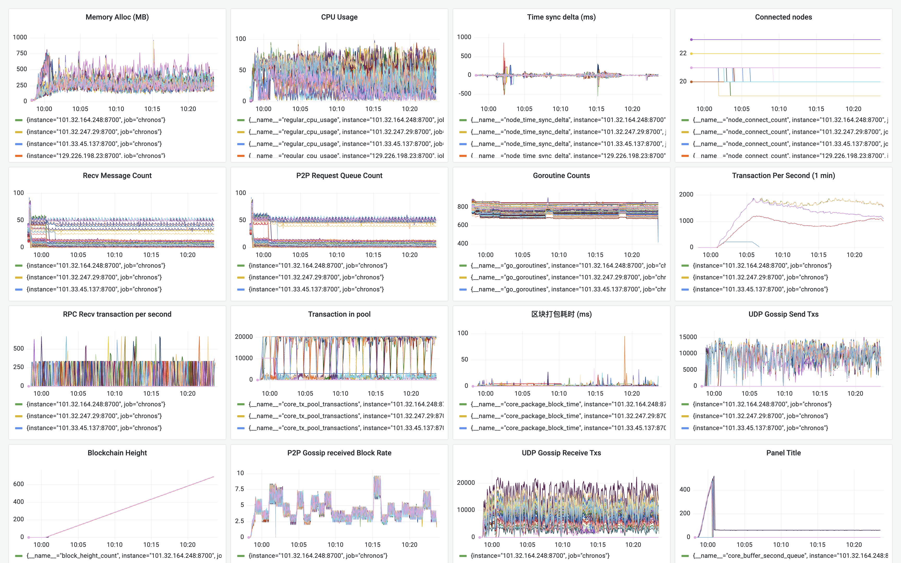

**日期**：2023.11.28

**git 版本号**：eaf2379（branch v1.0.1）

**节点数**：79 + 1

**区块打包间隔**：2s

**区块缓冲区大小**： 64

**VRF 选取阈值**： 0.9（选取节点概率 10%）

**服务器配置**：4 Core + 4 GB 内存

**单节点连接阈值**： 20

## 版本修改

与版本号 94e2a00 的对比:

* 修改了缓冲区逻辑以及交易生成器的 RPC 连接设置
    * 在此前缓冲区存在的问题是区块过多导致内存占用过高
    * 以及判断逻辑存在问题导致第二队列用塞进一步导致内存占用过高，区块数据无法正常被释放

## 测试结果

* 缓冲区逻辑错误修复完成，节点内存得到缓解
* 在 80 个节点的网络下能够正常运行，平均 tps 接近2000

## 测试数据

### TPS 绘图

![[2023-11-27 10:25:09]chronos_tps](./assets/[2023-11-27 10:25:09]chronos_tps.svg)

### Grafana 相关数据



http://localhost:3000/d/BsYlvN94k/chronos-core?orgId=1&from=1701050294848&to=1701051842673

### Graph 程序输出

```
timestamp: [10992 1999 1999 14 10 1982 15 -2 1987 13 1992 2014 2000 1997 1997 1997 1991 2001 1999 2017 2007 1999 1975 2001 2017 2008 1999 1999 1999 1977 1998 2020 2007 1977 2021 2003 2007 1974 2016 1984 2028 1992 1978 2022 1990 2012 1978 1997 2027 2001 1976 1952 2000 2000 2045 1955 2058 1988 2007 2008 1992 1948 1999 2001 2057 2003 1940 2063 1995 2012 1976 2002 2009 1989 1999 2010 2008 2000 2006 1975 2020 1998 2000 2026 1969 1917 2115 1961 2000 2013 1987 1998 2000 2022 2000 2004 2002 1979 2000 1990 2012 2013 1966 2039 1978 2000 1995 2021 2000 1993 2025 1970 1820 2156 1966 2055 2000 2001 2014 1764 2198 2036 1956 1976 2056 2032 1912 2088 1913 2082 1961 1957 2025 1975 2032 1999 2002 2026 2010 1956 2018 2008 1964 2297 1711 2042 1996 2011 1955 2017 2009 2001 2022 1978 1997 2003 2001 2020 1979 2015 2005 1998 2000 1978 2001 2000 2001 1992 2008 2021 2005 1997 1968 2000 2031 2000 1973 2000 1996 2030 1972 2027 1981 2000 2022 1995 1975 2000 2003 1997 2021 1978 2000 2022 2027 1984 1989 1970 2000 2028 1972 1976 2024 1998 2049 1981 1964 2067 1933 2017 2032 1984 1996 2014 1974 2015 1990 2030 2000 1993 2000 1989 1999 2000 2000 2001 2014 1955 2054 2005 1999 2000 1986 2000 2000 2000 2001 2000 2012 1988 2000 1991 2019 2000 1988 1996 1987 1975 2001 2000 2034 1966 2000 2041 1960 2037 1990 1973 2000 2023 1977 2019 1993 2024 1973 1994 2033 1992 2000 1974 2004 2036 1964 2000 1998 1990 1998 2001 2000 2005 1982 2029 1985 2033 1984 1986 1974 2038 1986 2002 1997 2031 2010 1965 2000 2000 2010 1998 2003 2000 1999 2004 2007 1982 2005 2011 2000 1991 2009 2022 1964 2000 2031 1977 2008 2008 1981 1995 2031 1985 2015 1990 1987 2008 1991 2002 2011 2000 1991 2018 1996 1979 2000 2000 2002 1998 2018 1982 2017 1982 2002 2042 2000 1965 1992 2018 2005 1981 1999 2020 1978 2003 2009 2006 1994 1989 2006 2018 1985 2000 2009 1993 1989 2038 1971 2000 2031 1989 2010 2000 1974 2004 2010 1998 1990 2023 1973 1994 2006 2025 1974 2029 1964 2006 2015 2011 1983 1985 2000 2000 2000 2010 2017 1997 2003 1983 2013 1987 2017 1983 2005 2015 1987 2007 1988 2001 2002 1985 2030 1970 2023 1977 2024 1976 2019 1979 2000 2001 2028 1973 2007 1971 2052 1970 2028 1967 2000 2033 1967 1990 2038 1945 2054 1956 1987 2047 1984 2028 1948 1999 2020 2027 2004 1991 1984 1994 1993 2032 1977 2016 1954 2030 2015 1985 1971 2041 2000 1989 2000 2011 1998 1957 2032 2017 2001 2004 1998 1991 1971 2000 2029 1924 2087 1997 1991 2000 1983 2026 2050 1968 1981 1983 2012 2008 2000 2048 1941 2021 2042 1937 2054 1948 1998 2000 2000 2003 2004 2000 2000 2002 1996 2008 1977 1711 2339 1960 2008 1982 2002 2015 2009 2001 2002 2008 1991 1997 1998 2002 1998 1946 2020 1981 2039 1941 2018 2060 2002 1942 1979 2084 1916 2077 1992 2000 1928 2089 2000 1993 1949 2067 1956 1951 2076 2001 1936 2039 1977 1983 2049 1936 1999 2067 1990 2010 1989 1974 1977 2026 2029 2013 1934 2000 2001 2047 2000 1966 2044 1995 2006 1997 1997 1972 2041 1987 2000 2020 2000 1939 2037 1995 1967 2033 2025 1982 1994 1961 2065 1988 1997 1964 1989 2034 2004 1963 2035 2017 1989 2011 1995 2002 1992 1997 2012 1998 1992 2010 1998 1991 2021 1983 1994 2019 2000 1988 2005 2000 2007 2002 1993 1998 2006 2000 1986 2032 1977 2008 1991 2009 1982 2033 1970 1999 2016 1984 2016 2015 1987 2013 1987 2013 1967 2033 1970 2011 1996 2010 1980 1992 2005 2005 2011 1986 2014 1999 1986 2005 2011 1999 1983 2016 1989 2012 1989 2010 1987 2002 1999 2000 2011 2000 1989 2013 1989 2010 1988 2012 1991 1999 2000 2000 2032 1967 2008 1994 2001 2033 1976 2024 1964]
counts: [0 0 0 0 0 0 0 0 0 0 1508 5224 814 4362 1422 2680 10000 2224 1935 10000 10000 546 10000 10000 10000 3484 10 9 1794 4423 3547 2480 2526 512 10 6 2088 3212 3003 3423 3097 2837 2585 3358 2769 2716 3085 1065 237 3550 10000 10000 10000 6511 3206 3395 3328 2332 3928 3199 3349 858 0 0 2206 3215 680 1189 4660 10000 6358 3898 3921 3223 3693 4093 3229 3486 10000 10000 9942 8395 5162 2129 2398 3622 3999 2760 2357 3629 1607 2795 3550 3237 3567 3253 3280 2518 837 2434 99 2795 2821 2913 2843 2660 1084 10000 10000 9999 5690 2977 3110 3078 1162 184 3181 3196 2924 3092 3224 2905 2773 2722 4 2468 2646 2538 3034 2918 2423 2201 2 0 9998 10000 10000 4445 3191 3221 2744 2823 1137 3 2 1692 2832 2536 2785 3334 2981 3110 2788 2123 1856 4047 3661 2764 2826 631 3440 2885 10000 10000 10000 6466 2449 2974 392 25 27 2537 2480 3126 2511 3276 2910 3236 996 179 3606 3087 3396 3010 2499 3423 3578 3266 3116 3341 10000 10000 10000 10000 6322 3545 4421 2988 3061 2434 2861 2315 1468 77 3443 2451 100 1739 3096 2822 3099 2941 1427 97 2947 20 2504 10000 10000 9987 5066 2743 2303 3214 3029 3390 2086 2 2506 3335 3529 3039 3537 3327 3361 3242 2143 3638 3527 3363 2256 2907 2136 3527 3492 3032 10000 10000 10000 512 461 1804 3446 3203 2975 2683 2426 1080 0 3097 3003 2802 146 1877 3332 3041 2626 2637 3077 3140 2750 2538 3022 2638 3055 10000 10000 10000 5002 1482 0 2663 361 650 2869 2533 0 2033 3366 2797 913 2 3692 2351 3430 2619 3250 2980 3411 3089 2307 1 10000 10000 10000 2016 2951 2099 514 433 2603 0 2670 2235 3059 2233 3199 2892 3022 2689 3109 2387 3674 2837 4047 2004 1 2802 222 1621 10000 10000 10000 5845 3136 3000 2504 2962 3094 3155 2957 452 14 0 0 855 3466 3210 3140 3089 2973 3093 3372 2737 3328 3197 1458 9120 10000 10000 7355 2284 3173 3408 3214 3145 3037 431 33 282 3253 3412 3404 2864 3770 2734 3066 2954 2946 1795 3000 793 3963 4421 3209 832 10000 10000 10000 5895 3312 3297 2613 470 1234 2821 2590 2387 2763 3608 3363 3146 2274 9 3490 2929 3465 2217 1504 3275 2141 3319 3230 1610 10000 10000 10000 6321 2327 3337 3190 526 1528 3070 2271 3023 2753 2525 2991 230 2439 3570 952 3678 3641 4232 4066 3084 3512 3948 3680 1831 2791 10000 10000 10000 5694 2629 2527 3179 2320 2326 3208 3667 2785 2328 1955 3107 3446 3339 3548 3201 2685 3951 3722 3377 2958 2271 3770 3204 3629 4394 2959 9997 10000 10000 5740 451 3140 4961 2871 3527 3702 2129 2063 574 3257 245 1970 3347 1170 3199 2829 3478 3744 3767 3538 2665 1266 940 4792 10000 10000 10000 9992 5281 3074 1900 2765 2225 178 2838 2563 2394 3515 2537 3047 2423 1834 3469 2773 1949 1054 2009 19 2781 2478 3520 3589 3007 2983 3295 9999 10000 9999 5737 3189 1226 297 3618 2692 2463 123 33 950 2069 17 2606 1689 3847 2447 2116 3258 2733 3928 2936 1779 62 2569 10000 10000 10000 4091 2748 3020 2991 2477 3046 3087 2641 3400 74 2131 1600 3867 3004 1716 2245 3045 733 1432 3347 53 2964 3044 3158 2170 3085 10000 10000 10000 9572 3822 2055 3658 3481 3433 3540 2802 2320 3566 3311 2755 2704 1328 310 3297 3488 3190 2071 3339 2453 1009 2023 4 1 10000 10000 9988 4754 2230 2872 686 561 3315 2380 3153 2861 2902 1036 4228 3275 3219 3520 214 2656 2899 3213 333 3166 3146 3337 4175 3165 4345 2954 10000 10000 10000 4877 36 3635 3108 2391 2961 3155 2699 2876 339 866 3510 2346 3192 3015 3189 3189 1805 2488 2684 846 0 2370 642 711 3336 10000 10000 10000 6512 2827 2135 2650 2560 1489 1487 2132 3467 4760 2111]
total: 2352290
packageAddr:  {"02141adb":25,"02164c00":3,"02496d67":9,"0254255a":13,"02647cdb":26,"026c390d":39,"0283bd22":4,"028cdc65":18,"028ebd92":5,"029a07c4":32,"02a9c40c":30,"02ab60bc":7,"02ae975e":14,"02af5975":1,"02d0a52e":25,"02d3052f":33,"02d3eccb":18,"02d9b80c":8,"02dc0d05":6,"02e47656":3,"02eb424c":3,"02fd536d":6,"0300507c":33,"031a5011":6,"0321bef6":18,"03259024":8,"032a2ab2":21,"0341dbca":20,"0353961d":5,"03606b7d":25,"03649d66":15,"03670418":21,"036fbde5":1,"03772d86":5,"037f8cc6":2,"03810755":14,"038b5019":22,"038c4548":4,"038cb0c1":3,"039c17ba":18,"039c2c17":1,"039cdff6":2,"03b0c70b":9,"03b41ace":14,"03c182a2":27,"03cfd1ba":16,"03de7cf5":4,"03e0d75d":13,"03f088c1":6,"03f86989":24,"03ffd1a3":4}
```

